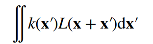
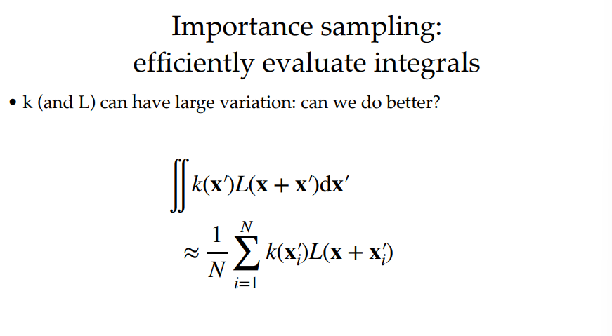
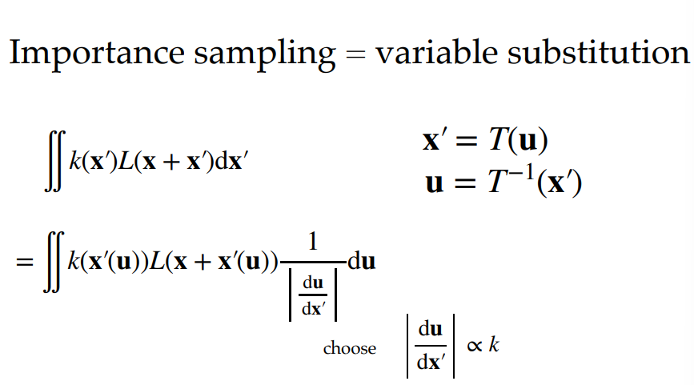
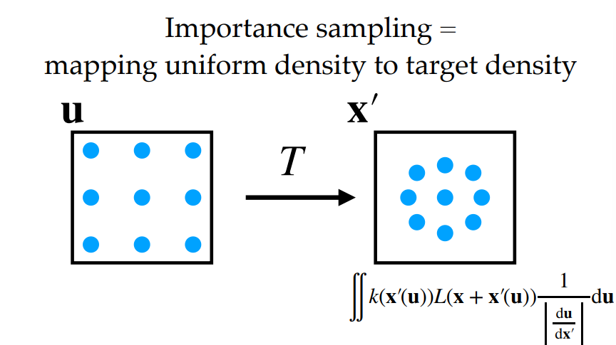
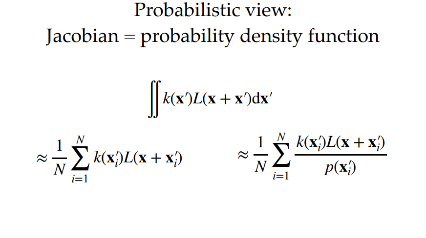
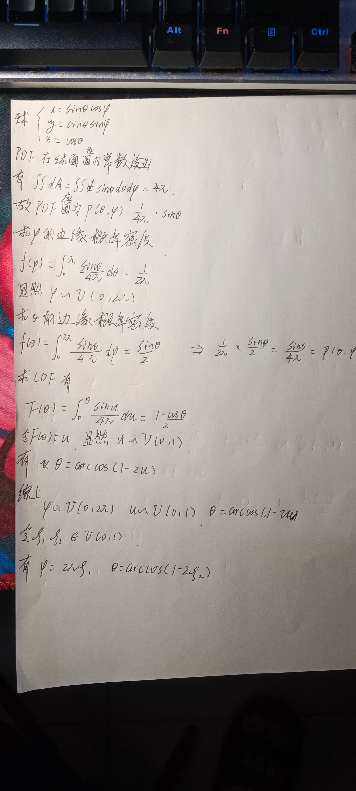
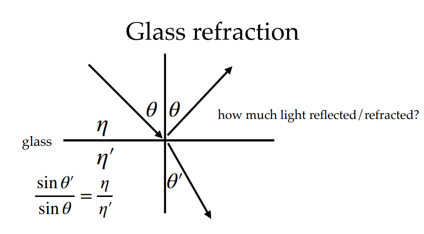
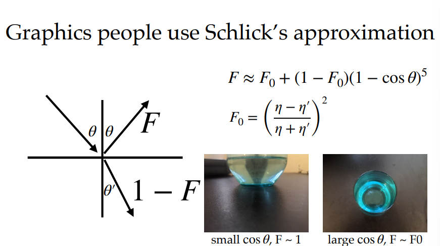
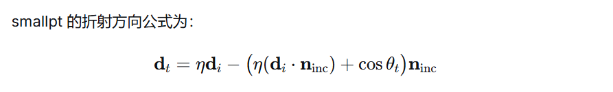
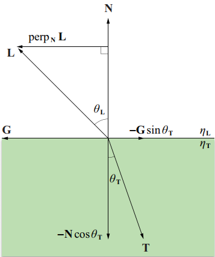

# 课程PPT链接： 
[cseweb.ucsd.edu/~tzli/cse272/wi2024/lectures/01_introduction.pdf](https://cseweb.ucsd.edu/~tzli/cse272/wi2024/lectures/01_introduction.pdf)
这个课程是一个 extremely hard-core about advanced rendering。所以其内容还是比较困难的，需要做好心理准备。

课程使用 Lajolla 这个源代码进行渲染
github: https://github.com/BachiLi/lajolla_public

# 课程目录：
有五大块，大D老师（Deepseek）帮忙解释一下各个名词。
## 一、 appearance modeling
**翻译**：外观建模
**介绍**：外观建模主要研究如何描述和表示物体表面与光的交互特性，从而准确呈现材质的视觉外观。它涵盖反射、折射、散射、纹理、颜色等属性，常用模型包括BRDF（双向反射分布函数）、BSDF（双向散射分布函数）等。外观建模是真实感渲染的基础，广泛应用于电影特效、产品设计和虚拟现实。
## 二、participating media 
**翻译**：参与介质  
**介绍**：参与介质指光线在传播过程中会与之发生相互作用的半透明或浑浊物质，如烟雾、云、雾、水、皮肤、牛奶等。这类介质会吸收、散射或发射光，导致光在介质内部发生复杂的能量分布变化。渲染参与介质需要求解辐射传输方程，常用方法包括体积路径追踪、光子映射或体素化技术。
## 三、production rendering
**翻译**：产品级渲染  
**介绍**：产品级渲染指在电影、动画、广告等商业制作中，追求高真实感、高艺术质量和可控性的渲染过程。它通常基于物理的光线追踪或路径追踪算法，支持复杂的材质、灯光、全局光照和运动模糊等效果。产品级渲染对计算资源要求极高，常采用分布式渲染农场，每帧可能耗时数小时甚至更久。
## 四、differentiable rendering
**翻译**：可微渲染  
**介绍**：可微渲染是一种新兴的渲染范式，它使得渲染过程对场景参数（如几何、材质、光源）的梯度可计算。通过将渲染器设计为可微分函数，可以结合深度学习或优化算法，实现从图像逆向推导最优的3D场景属性。可微渲染在逆渲染、三维重建、姿态估计和神经渲染等领域具有重要应用，是实现“从图像到模型”的关键技术。
## 五、efficient rendering
**翻译**：高效渲染  
**介绍**：高效渲染关注在有限的计算资源下，尽可能快速地生成高质量图像。它涵盖多种加速技术，如层次包围盒（BVH）、重要性采样、自适应采样、降噪算法、实时光线追踪、LOD（细节层次）和瓦片渲染等。高效渲染的目标是平衡画质与渲染时间，适用于实时交互、虚拟现实、移动设备以及大规模场景的可视化。

# 今天的主要内容：
了解一个99行完成的 path tracing，如果需要在本地跑，最好使用Linux，里面的函数erand48在Windows上可能没有定义，对这方面熟悉的同学可以去稍微弄一下，不熟悉建议直接使用Linux虚拟机。
源码：http://www.kevinbeason.com/smallpt/
这部分内容和games 101 的 ray trace 高度重合，建议优先学习或回顾 games 101。这边主要解释一下这个99行的代码一些小巧思和一些数学上的推导。

## 几何的隐式表示
首先，场景所有的物体都是通过隐式表述的。这就省去了建立BVH的过程，隐式表述时，光线和物体的交点可以通过数学上几何的方法直接得出。

## 基于三角形滤波的光线采样
生成光线时，采样一个三角形滤波，你可以简单认为，在生成的正中心的光线中做一个扰动，同时，通过三角形滤波使得其距离中心越进概率越大。在lajolla的代码也是存在这个方式。

## 计算间接光照时，对半球面进行余弦重要性采样
于games 101里面使用的均匀采样不同，这里面采用了不同的策略，从而使得方差更小。

## 菲尼尔项
不仅仅考虑反射，还考虑了折射
对于正确的菲尼尔项的计算，有兴趣的同学可以去阅读下面这PPT
链接：https://users.physics.ox.ac.uk/~lvovsky/471/labs/fresnel_brewster.pdf
在图形学领域，我们经常使用的是Schlick's approximation , 这时初始的F0，不仅仅决定了反射折射的能力，还决定了物体的颜色。

# 数学
这部分正确性可能不太高，是我个人的思考

## 像素着色
具体知识点为：**基于三角形滤波的光线采样**
对于一个像素来说，其着色应该是该像素”收到“的能量。即

对于计算机来说，要计算该数值，我们只能采样，这样就变成了一个离散的求和。即**黎曼积分**。

现在问题就变成了**采样和估计，主要矛盾是：如何正确且快速的去估计该像素的颜色**

于是就有了**重要性采样**
重要性采样在 games 101 在有详细的介绍一种方式：即在计算直接光照时对光源的采样。
为了**物理的正确性**，我们需要一种方法将积分进行转换，于是运用了**换元积分法**。
于是：

如果你理解了上述内容后续的估计都能看懂了
你也可以认为，**黎曼积分是一种采样概率为面积分之一的均匀采样的蒙特卡罗积分。**

**三角形滤波将一个原本应该进行均匀采样的黎曼积分变成了一个中间采样概率大，周边采样概率小的一个蒙特卡罗积分。

然后再结合蒙特卡罗积分**

## 概率分布的生成
如果你考研时概率论跟的是张宇，那么你应该会很熟悉一个内容，就是任何一个分布的分布函数会服从U(0 ~ 1)。而计算机生成，U(0 ~ 1)很方便，于是就有了通过反函数反求随机变量的一种方式。即**逆变换采样法**
以常用的在**球上均匀采样**为例上我的灵魂书写：
!

## BSDF
如果你和我一样只接触了games 101 202那么你对 BSDF不一定认识。
首先是大名鼎鼎的菲涅尔定理决定了反射和折射的方向：

对于多少能量反射多少能量折射，则引入一个折射率，使用Schlick's approximation

上述为前情提要。
## 代码实现思想：
### 如何得到切线方向
通过数学方式得到切线方向

以下是另一种推导

这时候，根据菲尼尔定理，我们可以得到sinθt 和对应的cosθt，同时，平面的法向量N是已知的。
由于L和T都是单位向量这时候我们只需要知道G方向即可得到折射方向。
对于折射方向，分解成于-N方向和-G方向的两个向量。对于-N方向的向量方向是已知，大小为cosθt。-G方向的向量方向未知，但大小为sinθt。这时候G方向和perpNL 方向相同，即G = (L - dot(L,N) * N) / sinθL
这时，T为两个分解向量的和。T = -N * cosθt + (- G * sinθt)
即T =  -N * cosθt - (L - dot(L,N) * N) / sinθL * sinθt
### 如何进行光线的递归选择
**判断是否发生全反射**
根据斯涅耳定律计算 cos⁡2θt=1−η2(1−cos⁡2θi)。
若 cos⁡2θt<0，则无折射光线，**只追踪反射光线**（反射率 R=1），直接返回反射贡献。
**计算反射率 R 和透射率 T**
使用精确菲涅尔公式或 Schlick 近似得到反射率 R（依赖于入射角、折射率）。
透射率 T=1−R（假设无吸收）。
#### 如果需要追踪反射和折射，则有两种递归方式
**确定性分裂和俄罗斯轮盘赌的方式进行递归追踪**
确定性分裂：同时追踪反射和折射两条光线，权重分为R和T
期望：E(Li) = R * Tr + (1 - R) * Tt
俄罗斯轮盘赌：以概率 P 追踪反射（权重 R/P），以概率 1−P追踪折射（权重 T/(1−P)）
smallpt 的混合策略：**深度较小时（≤2）使用确定性分裂**，避免早期随机截断造成的噪声；**深度较大时使用俄罗斯轮盘赌**，概率 P=0.25+0.5R
这时候需要修改权重分别为：R / P、(1 - R) / (1 - P);
这时期望为：E(Li) = R / P * P * Lr + (1 - R)/(1 - P) * (1 - P) * Lt = R * Tr + (1 - R) * Tt
**概率P的选择**：当 R 接近 0 或 1 时，例如 R=0.05，反射路径被选中的概率只有 5%，但反射分支的贡献可能并不小（例如高光环境）。这意味着大多数时候我们走折射分支，偶尔才走一次反射分支，而反射分支的权重没有被放大，导致**反射项的估计方差极大**（因为极少采样到）。同理，R 接近 1 时，折射分支采样不足。
为了降低方差，我们希望**两个分支被选中的概率不要过于悬殊**。常见的启发式是让概率 PP 位于某个中间范围，比如 [0.25, 0.75]。同时，为了保持无偏，需要给选中分支的贡献除以对应的概率（权重补偿）。
