# 课程PPT链接： 

## Next Event Estimation（下一事件估计）
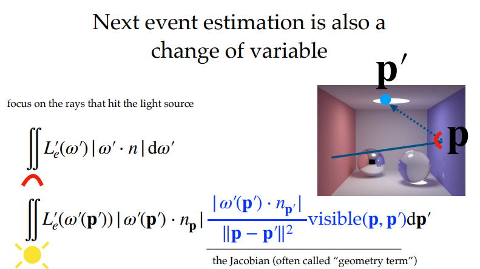
这个内容应该是对光源进行重要性采样，在GAMES101 光线追踪的课程中有详细的讲解。
这边对照了两个采样方式即Next event estimation 和 cosine weighted hemisphere
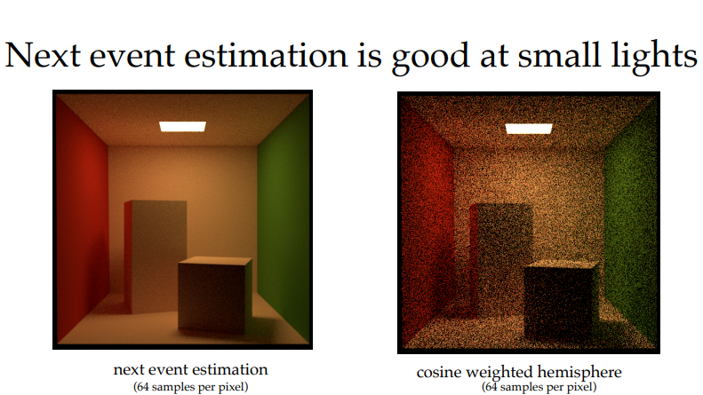
在小光源的情况下，NEE的效果会比较好
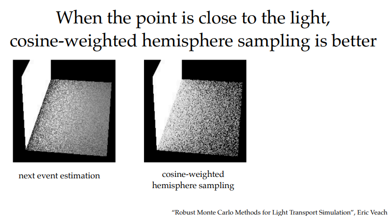
当接近光源时，则余弦加权采样的效果会比较好
**原因**
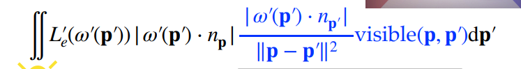
在NEE的公式中，需要除以r²，即除以距离的平方，当着色点距离光源很近时，分母上的 r² 会得到一个接近无限大的值（NaN）。
同时在进行 glancing angle 的采样时，可能会导致自遮挡，而NEE在上述场景中更加容易有glancing angle 的采样情况发生。
## Multiple importance sampling（多重重要性采样）
文中介绍了将NEE和余弦加权两种采样合并的多重重要性采样
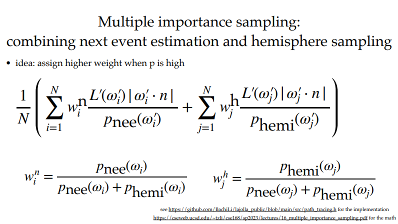多重重要性采样会中和两种采样方式的优点
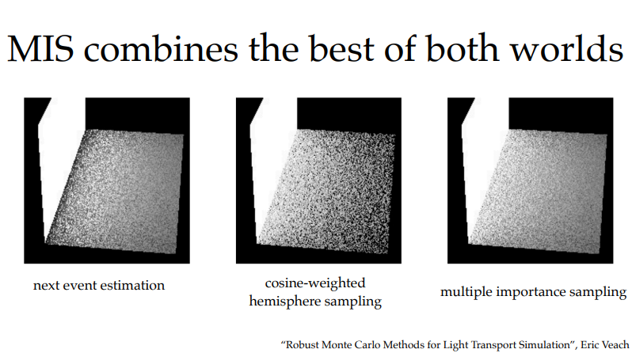
## 为何大多数模型的使用三角形作为图元
### 如何处理光线和三角形的相交
在GAMES101 光线追踪课程里面有更加详细的讲述。
### 如何快速判断光线于三角形是否可能相交
这里开始讲述包围盒(Bounding Volumes Hierarchy, BVH)
同样在GAMES101 光线追踪课程里面有更加详细的讲述。

### 如何将分布在模型的三维的颜色映射到一个二维的贴图
这个问题有点困难，而且是我没接触过的，PPT给出了一篇论文（Computational Peeling Art Design SIGGRAPH 2019），简述如何通过2D贴图反过来映射到三维模型上面
论文链接： http://staff.ustc.edu.cn/~fuxm/projects/Peeling/index.html
### 如何采样得到颜色
通过贴图和计算三角形的重心坐标进行采样

### Texture mapping: pros and cons(纹理映射的好处于坏处)
#### Pros：不同采样率（Separate Sampling Rates）
几何体的精细度（顶点密度/三角形数量）与表面颜色的精细度（纹理像素/纹素）彻底解耦。
通过纹理映射在一定程度上可以减少三角形数量，不需要无限精细的几何表示，只需要贴上一张贴图即可在“看起来”是正确的（例子一面凹凸不平且有特定花纹的墙）。
### Pros：更容易过滤（Much Easier to Filter）
在**2D 图像空间**做卷积比在**3D 不规则网格**上做平滑容易得多。
**几何过滤难**：如果想给一个粗糙的雕塑“磨皮”（低通滤波），需要移动顶点位置、改变拓扑，这是复杂的几何处理算法。
**纹理过滤易**：只需利用 **Mipmap** 或 **EWA 滤波**，根据光线微分（`Ray Differential`）或屏幕像素覆盖率，在预计算的图像金字塔里做**三线性插值**或**各向异性采样**。
####  Cons：UV 映射很难（UV Mapping is Hard）
将一个**三维表面**无扭曲地摊平到**二维平面**，且要求接缝处连续、纹理密度均匀，是一个数学上的**全局最优化难题**。就好像你无法摊平3D的地球表面做出来一个世界地图。
**失真（Distortion）**：球面映射必然导致极点处纹理挤压（Pinching）。 
**接缝（Seams）**：为了摊平封闭网格，必须切开网格。切开处会导致纹理滤波在边界处**无法正确跨缝采样**，需要依赖纹理集（Texture Atlas）或复杂的边界填充算法。
**手动劳动**：绝大多数美术资产至今仍依赖**手动展 UV**，这是一个极其枯燥且容易出错的环节，直接拉高了 CG 内容制作的成本。
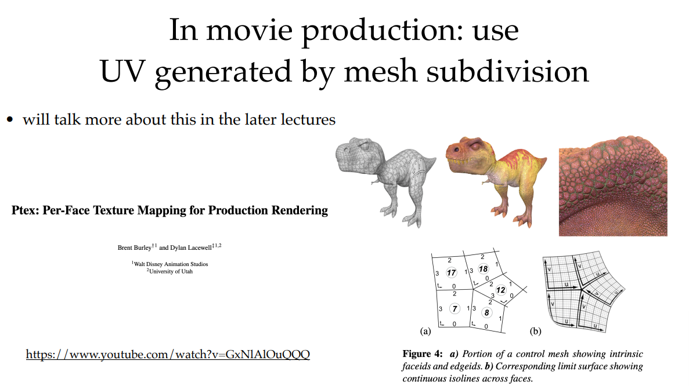
### Pixel到纹理的映射可能是一片有面积的纹理，而不是某一点
这个在GAMES101中关于纹理的各项异性和mipmap的讨论中有说
至于文章中的二维函数的一阶泰勒展开，可理解为，通过屏幕空间的相邻像素的纹理坐标的变化率（导数），去估计一个Pixel在纹理上的跨度，根据该跨度进行不同LOD的Mipmap的选择。也可以在不同的Mipmap上进行三线性插值（Trilinear Interpolation）。
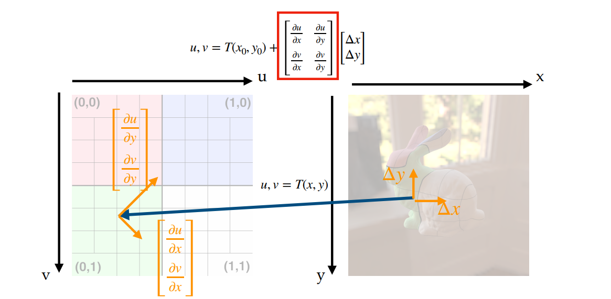

### 对于三角形来说，其构成的模型肯定是有棱有角的，对于这种情况，可以在三角形里面用重心坐标插值来得到一个较为圆滑的过度
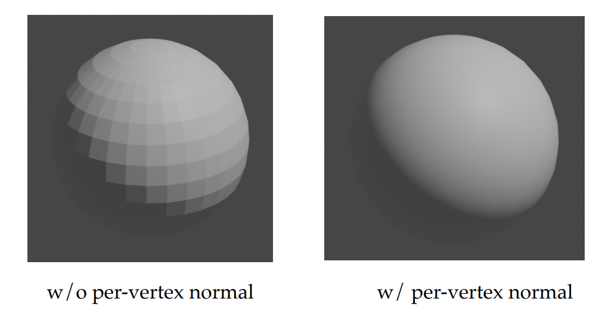

### **用于计算光照的“着色法线”与用于判断光线遮挡的“真实几何表面”指向了不同的方向**。
**真实几何法线（`geometry_normal`）**：由三角形的三个顶点严格定义，垂直于那个唯一的平面。它决定了**光线在哪里反弹、物体是否被遮挡**。
**着色法线（`shading_frame.n`）**：通过**顶点法线插值**或**法线贴图**扰动后得到的法线。它让只有 12 个三角形的模型看起来像有 12 万个三角形的圆润曲面。
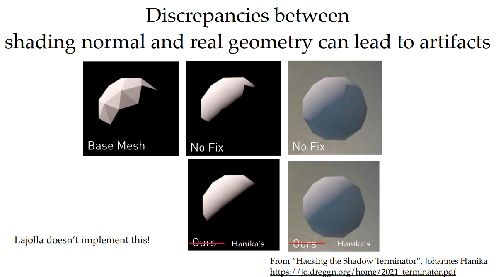
2021年《Ray Tracing Gems II》收录的一篇论文《Hacking the Shadow Terminator》，尝试解决这个问题。论文将通过一个阴影函数生成的概率作为额外的因子，柔和地衰减掉原本不该出现的光照。这样一来，原本突兀、锯齿状的明暗交界线，就会变成平滑、柔和的自然过渡，从而在极低的计算成本下“黑掉”（Hack）了问题，实现了高质量的渲染效果。
## 环境贴图
在GAMES101和 Learn OpenGL 里面都有详细的说明
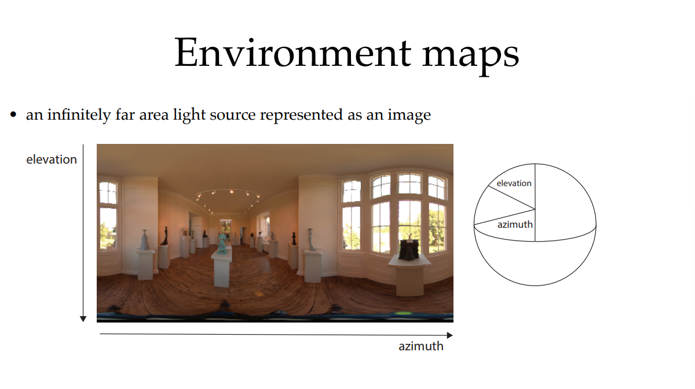
# 数学
大多数数学知识点在GAMES101上面有
## 重要性采样和多重重要性采样中的期望计算

### 均匀半球采样的蒙特卡洛无偏性验证

#### 渲染方程（反射部分）
$$
L_o(\omega_o) = \int_{\Omega^+} L_i(\omega_i) \, f_r(\omega_i, \omega_o) \, \cos\theta_i \, d\omega_i
$$
记被积函数 $g(\omega_i) = L_i(\omega_i) f_r(\omega_i,\omega_o) \cos\theta_i$，积分 $I = \int_{\Omega^+} g(\omega) d\omega$。
#### 均匀采样
上半球立体角 $2\pi$，采样概率密度：
$$
p(\omega) = \frac{1}{2\pi}, \quad \omega \in \Omega^+
$$
#### 蒙特卡洛估计量
抽取 $n$ 个独立样本 $\omega_1,\dots,\omega_n$：
$$
\hat{I} = \frac{1}{n} \sum_{i=1}^n \frac{g(\omega_i)}{p(\omega_i)} = \frac{1}{n} \sum_{i=1}^n 2\pi\, g(\omega_i)
$$

### 无偏性证明
$$
\mathbf{E}[\hat{I}] 
= \frac{1}{n} \sum_{i=1}^n \mathbb{E}\left[ \frac{g(\omega_i)}{p(\omega_i)} \right] 
= \mathbf{E}\left[ \frac{g(\omega)}{p(\omega)} \right] 
= \int_{\Omega^+} \frac{g(\omega)}{p(\omega)} \, p(\omega) \, d\omega \\
= \int_{\Omega^+} g(\omega) \, d\omega = I
\qquad
(\omega \sim p) 
$$
因此 $\mathbb{E}[\hat{I}] = I$，估计量无偏。

> 注意：无偏性对任何满足 $p(\omega)>0$ 当 $g(\omega)\neq 0$ 的采样分布都成立。
### 余弦加权半球采样的蒙特卡洛无偏性验证
这次试试带入计算
#### 渲染方程（反射部分）
$$
L_o(\omega_o) = \int_{\Omega^+} L_i(\omega_i) \, f_r(\omega_i, \omega_o, n) \, cos(\theta_i) \, d\omega_i = I
$$
对于余弦加权半球采样：有球表达式
$$
x = \sin(\theta)\, \cos(\phi) 
y = \sin(\theta)\, \sin(\phi) 
z = \cos(\theta) 
$$
$$
P(\omega) = C\  * \ cos(\phi) \qquad (C 为常数)
$$
故有
$$
\int_{\Omega^+} P(\omega)\ d\omega = 
\int_{\Omega^+} C \cos(\theta) \ d\omega_i =
\int_{0}^{2\pi}d\phi \int_{0}^{\pi / 2} C\ \cos(\theta)\ \sin(\theta)\ d\theta = 1
$$
解得
$$
C = \frac{1}{\pi}
$$
即
$$
P(\omega) = \frac{\cos(\theta)}{\pi}
$$
#### 蒙特卡洛估计量
抽取 $n$ 个独立样本 $\omega_1,\dots,\omega_n$：
$$
\hat{I} = \frac{1}{n} \sum_{i=1}^n \frac{L_i(\omega_i)\ f_r(w_i,\ w_o,\ n)\ \cos(\theta_i)}{\frac{cos(\theta_i)}{\pi}}
$$
#### 无偏性证明
$$
\mathbf{E}[\hat{I}]
= \frac{1}{n} \sum_{i = 1}^n \mathbf{E}\left[ \frac{L_i(\omega_i)\ f_r(w_i,\ w_o,\ n)\ \cos(\theta_i)}{\frac{cos(\theta_i)}{\pi}} \right]
$$
$$
= \mathbf{E} \left[ \frac{L(\omega_i)\ f_r(\omega_i,\ \omega_o,\  n)\ \cos(\theta_i)}{\frac{\cos(\theta_i)}{\pi}} \right] 
$$
 $$
= \int_{\Omega^+} \frac{L(\omega_i)\ f_r(\omega_i,\ \omega_o,\  n)\ \cos(\theta_i)}{\frac{\cos(\theta_i)}{\pi}} \ * \ \frac{\cos(\theta_i)}{\pi} \  d\omega_i 
$$
$$
= \int_{\Omega^+} L(\omega_i)\ f_r(\omega_i,\ \omega_o,\  n)\ \cos(\theta_i) \  d\omega_i = I
$$
因此 $\mathbb{E}[\hat{I}] = I$，估计量无偏。
### 多重重要性采样中的期望计算
这部分要比上一部分要难上不少，做好心理准备
##### 单种策略的蒙特卡洛估计

如果只用第 $i$ 种策略，抽取 $n_i$ 个独立样本 $\omega_{i,1},\dots,\omega_{i,n_i} \sim p_i$，则标准估计量为：

$$
\hat{I}_i = \frac{1}{n_i} \sum_{j=1}^{n_i} \frac{f(\omega_{i,j})}{p_i(\omega_{i,j})}.
$$

这是无偏的：$\mathbf{E}[\hat{I}_i] = I$。但方差可能很大，尤其当 $p_i$ 与 $f$ 形状不匹配时。

##### 朴素组合：混合采样分布

构造混合分布：

$$
p_{\text{mix}}(\omega) = \sum_{i=1}^k c_i \, p_i(\omega), \quad \sum_i c_i = 1, \quad c_i \ge 0.
$$

tips: 为何混合分布是一个求和，因为每个概率分布都包含了一个 $\omega_i$ 所以 选到 $\omega_i$ 的概率为所有不同分布的 $\omega_i$ 乘以权重之和
从 $p_{\text{mix}}$ 中抽取样本 $\omega$，标准蒙特卡洛估计量：

$$
\hat{I}_{\text{mix}} = \frac{1}{N} \sum_{t=1}^{N} \frac{f(\omega_t)}{p_{\text{mix}}(\omega_t)}.
$$

这也是无偏的。从混合分布采样等价于先以概率 $c_i$ 选策略 $i$，再从其 $p_i$ 中采样。估计量可写为：

$$
\hat{I}_{\text{mix}} = \frac{1}{N} \sum_{t=1}^{N} \frac{f(\omega_t)}{\sum_i c_i p_i(\omega_t)}.
$$

##### 推广：允许每个样本有不同权重

对于来自策略 $i$ 的样本，赋予权重 $w_i(\omega)$，估计量：

$$
\hat{I} = \sum_{i=1}^k \frac{1}{n_i} \sum_{j=1}^{n_i} w_i(\omega_{i,j}) \frac{f(\omega_{i,j})}{p_i(\omega_{i,j})}.
$$

其中 $\omega_{i,j} \sim p_i$。期望：

$$
\mathbf{E}[\hat{I}] = \sum_i \int w_i(\omega) \frac{f(\omega)}{p_i(\omega)} \, p_i(\omega) d\omega = \int \left( \sum_i w_i(\omega) \right) f(\omega) d\omega.
$$
tips:对有限项积分和求和能调换。
$$
\begin{aligned}
\int(f_1(x) \ + \ f_2(x)) \ dx = \int f_1(x)\ dx + \int f_2(x)\ dx
\end{aligned}
$$
要求无偏，则需对几乎处处 $\omega$ 满足：

$$
\sum_{i=1}^k w_i(\omega) = 1.
$$

##### 如何选择权重以降低方差？

在约束 $\sum_i w_i(\omega)=1$ 下，最小化方差近似得 $w_i \propto p_i$。结合和为1：

$$
w_i(\omega) = \frac{p_i(\omega)}{\sum_{j=1}^k p_j(\omega)}.
$$

此为**平衡启发式**。若样本数 $n_i$ 不同，修正为：

$$
w_i(\omega) = \frac{n_i p_i(\omega)}{\sum_j n_j p_j(\omega)}.
$$

##### 最终估计量形式

代入权重得 MIS 估计量：

$$
\hat{I}_{\text{MIS}} = \sum_{i=1}^k \frac{1}{n_i} \sum_{j=1}^{n_i} \frac{n_i p_i(\omega_{i,j})}{\sum_{\ell} n_\ell p_\ell(\omega_{i,j})} \cdot \frac{f(\omega_{i,j})}{p_i(\omega_{i,j})}
= \sum_{i=1}^k \frac{1}{n_i} \sum_{j=1}^{n_i} \frac{n_i \, f(\omega_{i,j})}{\sum_{\ell} n_\ell p_\ell(\omega_{i,j})}.
$$

化简：

$$
\hat{I}_{\text{MIS}} = \sum_{i=1}^k \sum_{j=1}^{n_i} \frac{f(\omega_{i,j})}{\sum_{\ell=1}^k n_\ell p_\ell(\omega_{i,j})}.
$$

若所有 $n_i = N$，则：

$$
\hat{I}_{\text{MIS}} = \frac{1}{N} \sum_{i=1}^k \sum_{j=1}^{N} \frac{f(\omega_{i,j})}{\sum_{\ell=1}^k p_\ell(\omega_{i,j})}.
$$

##### 期望验证（无偏性）

$$
\mathbf{E}[\hat{I}_{\text{MIS}}] = \sum_{i=1}^k \sum_{j=1}^{n_i} \mathbf{E}\left[ \frac{f(\omega_{i,j})}{\sum_{\ell} n_\ell p_\ell(\omega_{i,j})} \right] \\
= \sum_{i=1}^k n_i \int \frac{f(\omega)}{\sum_{\ell} n_\ell p_\ell(\omega)} \, p_i(\omega) \, d\omega 
$$
$$
= \int \frac{f(\omega)}{\sum_{\ell} n_\ell p_\ell(\omega)} \left( \sum_{i=1}^k n_i p_i(\omega) \right) d\omega 
$$
$$
= \int f(\omega) \, d\omega = I.
$$

因此估计量无偏。