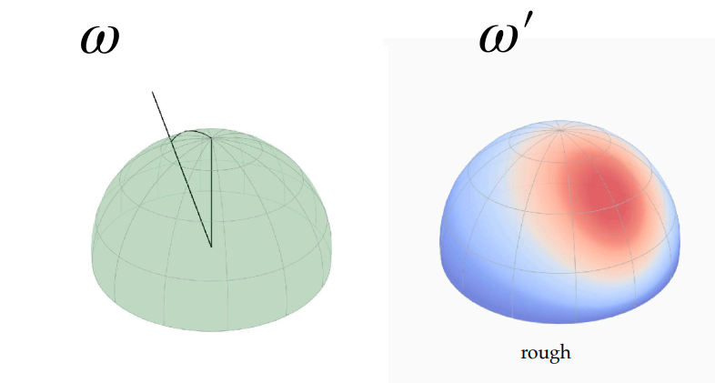
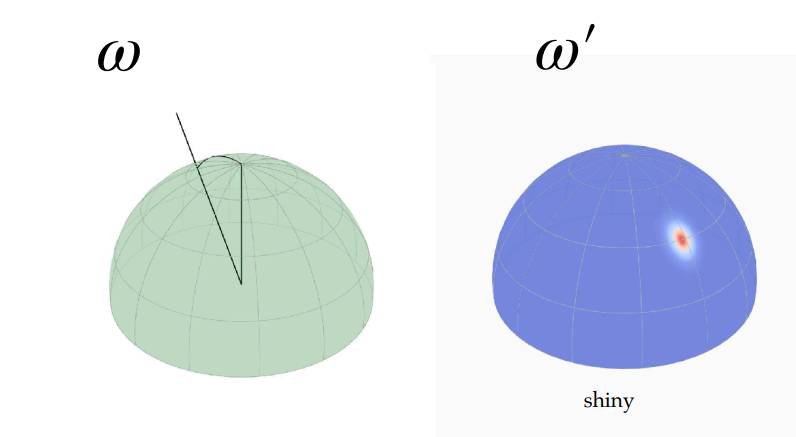
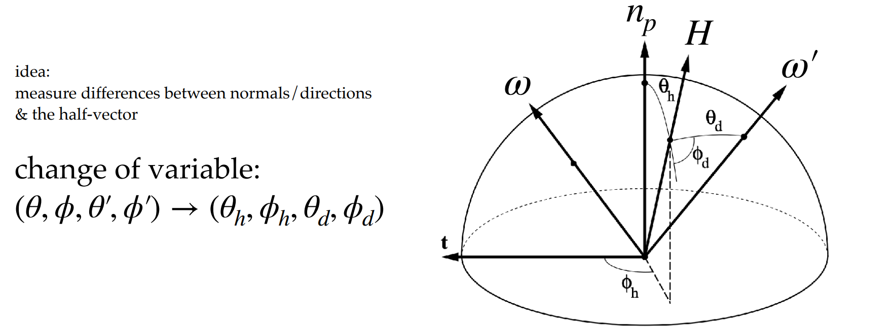
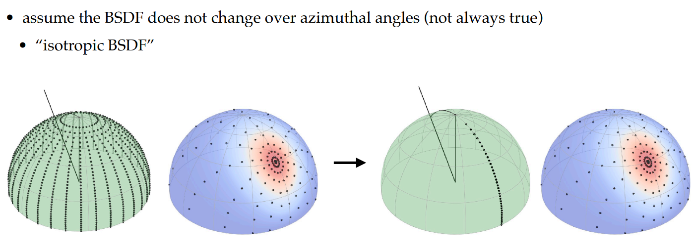
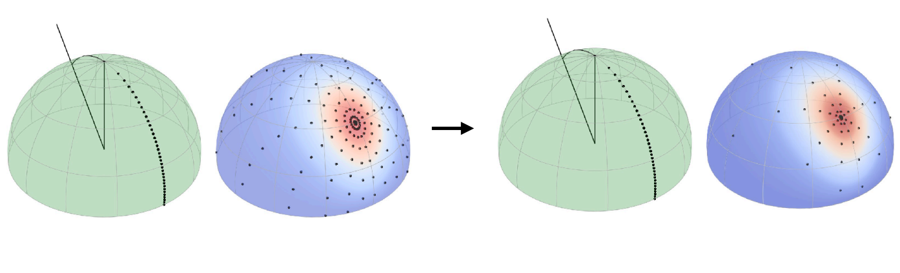
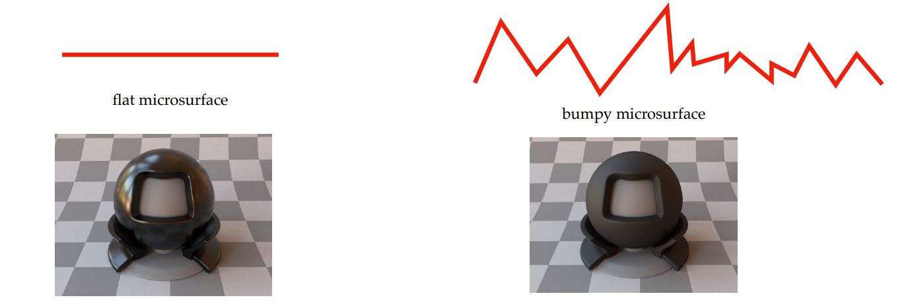
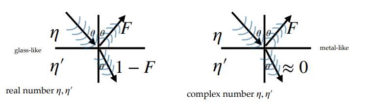
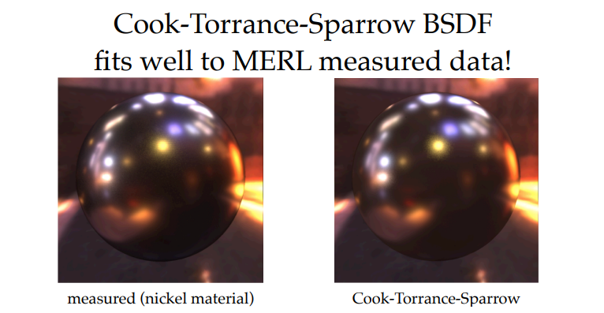
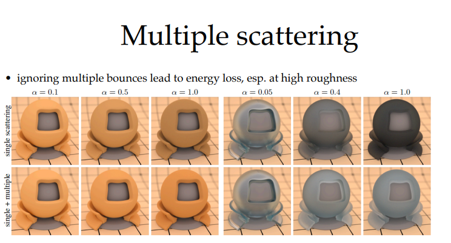

# 课程PPT链接： 
# 这次的PPT内容比较碎，很多都是概念上的东西

# BSDF 基础定义与性质
## 函数表示
$f_p(\omega, \omega')$ ，定义了光线从方向$\omega'$入射后，在方向 $\omega$ 上的能量分布。
## 入射角的权重
对于入射角和反射角，我们假设反射角（人眼）为$\omega$， 入射角（光源）为$\omega'$，则其入射角的光源对于反射角方向的光源贡献是一个球面上的一个分布。具体rough 和 shiny 如下图

## 各项同性BRDF和各项异性BRDF
各项同行BRDF将4D的函数降为到了3D（因为对于某一入射光源，反射光源分布是对称的）。而各项异性则保持4D的复杂度
!
## 互易性
$f_p(\omega, \omega') = f_p(\omega', \omega)$
**例外情况**：涉及不同折射率介质时需修正；吸收介质（金属）或法拉第旋光器会破坏互易性。
## 能量守恒 
**积分约束**：$\int f_p(\omega, \omega') |n_p ⋅ \omega'| \ d\omega' <= 1$ 

# BSDF 的测量
#### 直接测量法：
使用机械臂（Gonioreflectometer）扫描 4D 域。
**挑战**：极其耗时（可能需数年），数据量巨大（数GB），且难以支持空间变化的纹理。
#### 优化采集的 Trick
**Rusinkiewicz 参数化**：使用半向量 H 和差向量，将测量集中在镜面反射方向附近。
!
**假设各向同性**：忽略方位角变化。
!
**自适应参数化**：根据粗糙度缩放采样区域（Dupuy & Jakob 2018）。
!
#### 经典数据集
**MERL Database**：100种各向同性材质，存在相机伪影问题。
**EPFL / UCSD 数据集**：包含各向异性数据，质量更高。

# 微表面理论
假设，平面由无数微小的完美镜面（Microfacets）组成。
同时对于法线为 $H=normalize(\omega+\omega') \ H=normalize(\omega+\omega')$ 的微表面才对 $\omega→\omega'$ 的反射有贡献。
## 法线分布函数
即，描述微表面法线的统计分布。
对于平滑曲面，其反射强度比较高，而对于粗糙平面，其反射强度比较低
!
这部分概念在GAMES 101 和 202 有很详细的讲解
**Beckmann**：基于高斯分布的坡度。
**GGX (Trowbridge-Reitz)**：具有**长尾**特性（对应材质高光的"光晕"感），是目前行业标准。
# Cook-Torrance-Sparrow BRDF 模型

这是微表面理论的具体数学实现。
**核心公式**：
$$
f_p(\omega, \omega') = \frac{D(H)G(\omega, \omega', H)F(\omega, H)}{4|\omega · n_p| \  |\omega\ · n_p|}
$$
**三大组件**：
这部分概念在GAMES 101 和 202 有很详细的讲解
D：法线分布函数。 
G：几何遮蔽/阴影函数。基于 **Smith 假设**（微表面空间不相关）推导，描述微表面间的遮挡。
F：菲涅尔项。描述反射率随角度变化。
我们经常使用 Schlick's approximation 来拟合菲涅尔项
$$
F \approx F_0 \ +\  (1 - F_0)(1 - \cos\theta)^5
$$
同时 
$$
F_0 = (\frac{\eta \ -\  \eta'}{\eta \ +\ \eta'})^2
$$
其中 $\eta ,\  \eta'$为折射率
!
Cook-Torrance 方法在某些程度上与MERL测量得效果十分相似
!
但对于微表面模型有其限制：
难以模拟蝴蝶翅膀的结构色、复杂的雾状各向异性等现象。
同时，只考虑了一次弹射
因此会造成能量损失
!
PPT也指出，这种损失在一定程度上是可以接受的。
同时，可以通过一些数学的方法来对能量进行补偿。当然，这部分在GAMES 202 中有非常详细的讲解
# 数学
这部分数学我只能说暂且搁置（内容实在是太多，主要还得啃论文）。如果有兴趣可以去看看GGX， Smith G等相关论文。这些内容等我哪天开始啃了，就写一下。
“A New Change of Variables for Efficient BRDF Representation”_ (Rusinkiewicz, 1998) 提出将 BRDF 表示为 $(\omega_h, \omega_d)$ 的形式。[A New Change of Variables for Efficient  BRDF Representation](paper/A%20New%20Change%20of%20Variables%20for%20Efficient%20%20BRDF%20Representation.md)

