# Introduction
这节课主要是探讨一下迪士尼的 BRDF 是这么从原来的 BRDF 上得来的。没有涉及到原理的 BRDF 怎么推导。
# Traditional way of assigning materials
!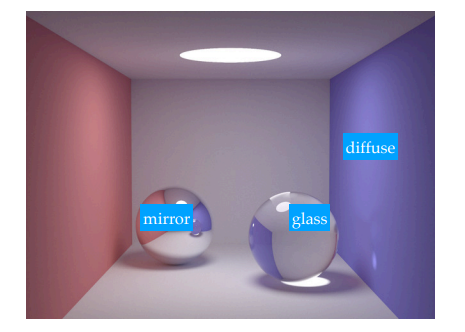
不够灵活，同时如果想要达到的效果为，一半 glass 一半 diffuse 的话就不太行了。
# 线性组合思想
$$
f = \sum \omega_i f_i
$$
其存在隐患，如果权重大于1，则可能导致能量不守恒。
# 一个工业界的方式：迪士尼 BSDF
## 设计原则
1.艺术家友好（直观）。
2.任意组合都有意义（不会调出“黑屏”或“核爆”亮度）。
3.物理启发（参考 MERL 数据）。

## Disney BSDF的“材质树”组合（Disney BSDF: combination of 5 BSDFs）
它不是简单的数学加总，更像一个有逻辑的、像Photoshop图层一样的“配方”。它通过一个名为“**金属度（metallic）**”的核心参数，首先在庞大的“**金属材质分支**”和“**非金属材质分支**”之间做抉择。然后，非金属分支内部再依次叠加**基础漫反射、次表面散射、光泽、清漆**这四个“图层”，最终混合成完整的材质。这更像一个灵活的“材质树”，而非一个固定的加法公式。
!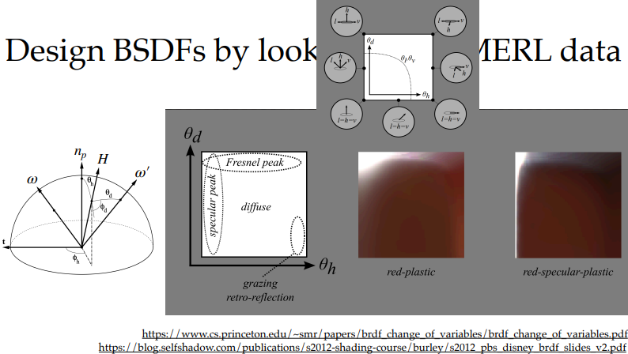
## 四个特征区
#### ① 镜面反射峰 (Specular Peak)
**真实坐标**：$\theta_h \approx 0, \theta_d \approx 0$ 
**图像位置**：**左下角原点附近**
**物理成因**：半角向量 $h$ 紧贴法线 $\theta_h$ 小，且入射光与 $h$ 夹角极小 $\theta_d$ 小，即视线恰好位于镜面反射方向。这是光滑表面直接反射光源的亮斑。

#### ② 漫反射基底 (Diffuse Baseline)
**真实坐标**：$\theta_h$ ​ 任意，$\theta_d \approx 90°$ 
**图像位置**：**水平中线附近**（$Y \approx 90°$ 的横带）
**物理成因**：$\theta_d = 90°$  意味着 $i · h = 0$ ，即入射光垂直于半角向量。此时微表面法线 $h$ 与入射方向正交，镜面反射贡献降为零，只剩下多次散射的漫反射成分。这是材质固有颜色最纯净的区域。

#### ③ 菲涅尔边缘光 (Fresnel Edge)

**真实坐标**：$\theta_h$  由光滑到粗糙扩散，$\theta_d$ -> $90°$ 但 $i$ 和 $o$ 均接近水平（掠射角）
**图像位置**：**顶部边缘**（Y 接近 180° 的映射区），实际对应真实 $\theta_d \approx 90°$ 且 $i, o$ 都平躺的情况。
**物理成因**：在真实几何中，当 θd≈90∘θd​≈90∘ 且入射/出射方向都接近水平时，Fresnel 效应使反射率急剧增强。切片图通过对称映射将这一部分显示在顶部，便于观察。

#### ④ 掠射逆反射 (Grazing Retro-reflection)

**真实坐标**：$\theta_h$ -> 90°，$\theta_d \approx 0°$ 
**图像位置**：**右下角**（X 大，Y 小）
**物理成因**：半角向量极度倾斜（$\theta_h$​ 大），但入射光与 $h$ 夹角极小（$\theta_d$​ 小），意味着视线与入射光几乎同向且都贴近表面。粗糙表面的遮挡效应使部分光线原路返回，形成局部亮度隆起。

## Lambert 模型的缺点
Lambert 模型，即最基本的漫反射材质，BRDF：$f = \frac{Color}{\pi}$
缺点：它忽略了掠射逆反射。比如一个粗糙的篮球，边缘应该比中心稍亮一点，但 Lambert 计算出来边缘是暗的。

## 重新分析漫反射
**Microfacet Theory**（微表面理论）。表面粗糙导致光线散开。
**Subsurface Scattering**（次表面散射）。光进入物体内部游走一圈再出来。
!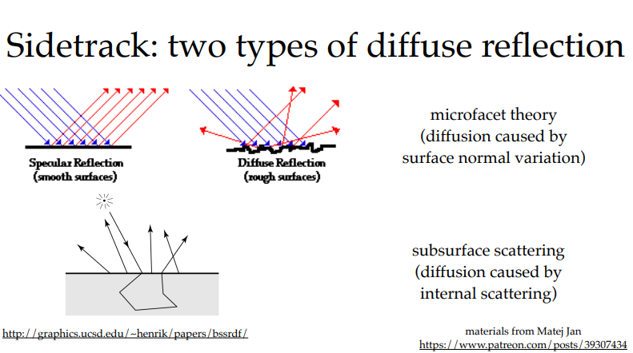
**Diffuse（漫反射）这个词太笼统**。物理上必须区分这两种，因为它们的**掠射角表现完全不同**：
微表面粗糙：边缘亮（逆反射）。
次表面散射：边缘暗（光透进去损失能量了）。
!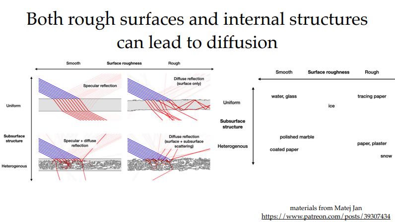
### Oren-Nayar模型：专攻表面  
由Michael Oren和Shree Nayar在1994年提出，核心是**微表面理论**与**自阴影**。它假设表面由**无数微小的V形凹槽构成**，重点计算相邻微表面之间的**相互遮挡**。这完美解释了为何粗糙表面在光线斜射时，其漫反射部分并非像理想Lambert模型那样均匀变暗，而是在特定角度产生独特的增亮。它的“主战场”就是**粗糙的非金属表面，比如砂石、布料、月球表面**。

### Lommel-Seeliger & Hanrahan-Krueger模型：透视内部
**Lommel-Seeliger 定律**：这是一个更古老的定律，最初被用来很好地模拟**月球土壤**的反射特性。其核心公式 $\frac{1}{\cos\theta_i + \cos\theta_o}$  描述的是光线在介质中发生**各向同性单次散射**后的出射结果。
**Hanrahan-Krueger 模型**：这是一个更现代、更强大的模型。它专为**多层表面**（如皮肤的表皮、真皮）设计，通过一维线性传输理论，精确推导出光在层状介质中的**反散射**和**透射**公式。对于模拟皮肤、树叶等半透明材质，它提供了坚实的物理基础。
!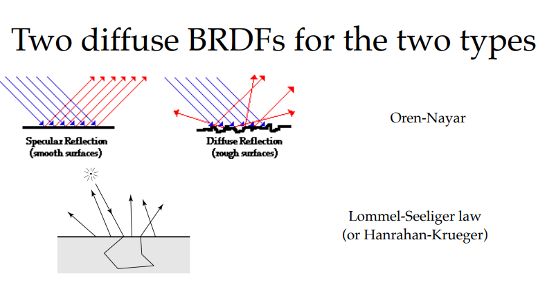
### Oren-Nayar BRDF
!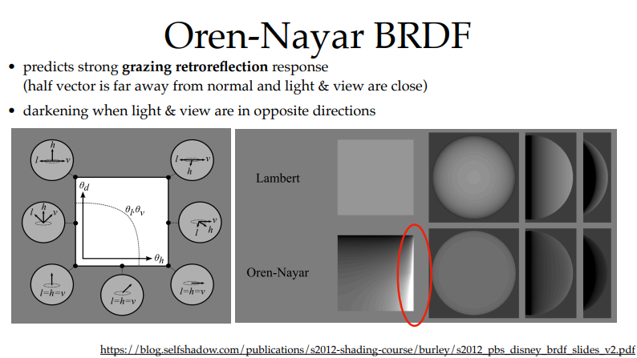
对比起 Lambert BRDF, Oren-Nayar 的 BRDF 在 掠射逆反射 (Grazing Retro-reflection)，即图中右下角$(\theta_h \approx 90°, \theta_d 任意)$ 时，会出现高亮

### Lommel-Seeliger & Hanrahan-Krueger模型
**基本假设**：表面光滑，且光会进入介质内部后发生散射和吸收
其BRDF 为 
$$
f_p(\omega, \omega') = \frac{color}{4\pi} · \frac{1}{|\omega · n_p|\ +\ |\omega' ·n_p|}
$$
当当入射光和视线**都垂直于法线**（即两者都与法线成 90° 角，$\cos⁡\theta_i→0$, $\cos\theta⁡_o→0$）时：
**分母趋于 0**：$0+0=0$。
**BRDF 值趋于无穷大**：$f_p→∞$。
**物理现象**：这对应的是**光线几乎平行于表面擦过，且视线也在同一侧平行于表面观察**的极端掠射配置。此时，光在介质内部传播的路径极短，且由于表面光滑，光几乎无损耗地**透射**出来，形成极其强烈的**边缘透射峰**。
!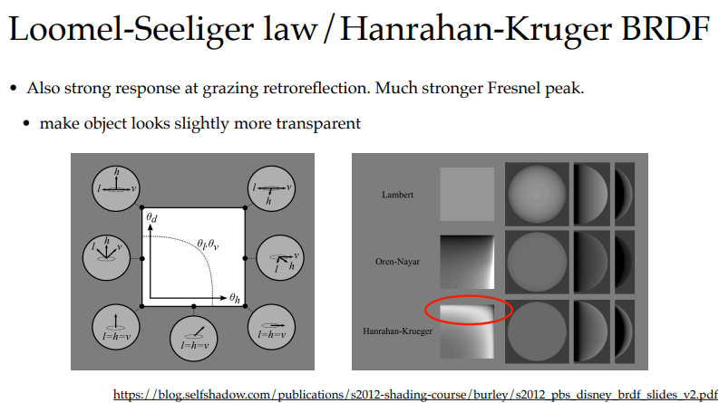
这不同于 Oren-Nayar 的**逆反射**。Lommel-Seeliger 的峰值在 $\theta_d \approx 90°$ 且 $θ_h$ 大 的配置（对应于切片图的顶部边缘或右上角），表现为极强的**半透明边缘光**。即
菲涅尔边缘光 (Fresnel Edge)：
物理成因：在真实几何中，当 $\theta_d \approx 90°$ 且入射/出射方向都接近水平时，Fresnel 效应使反射率急剧增强。切片图通过对称映射将这一部分显示在顶部，便于观察。
## BSDF 和 BSSRDF
BSDF 假设光从哪里进就从哪里出。真实次表面散射（BSSRDF）光会扩散到附近区域。!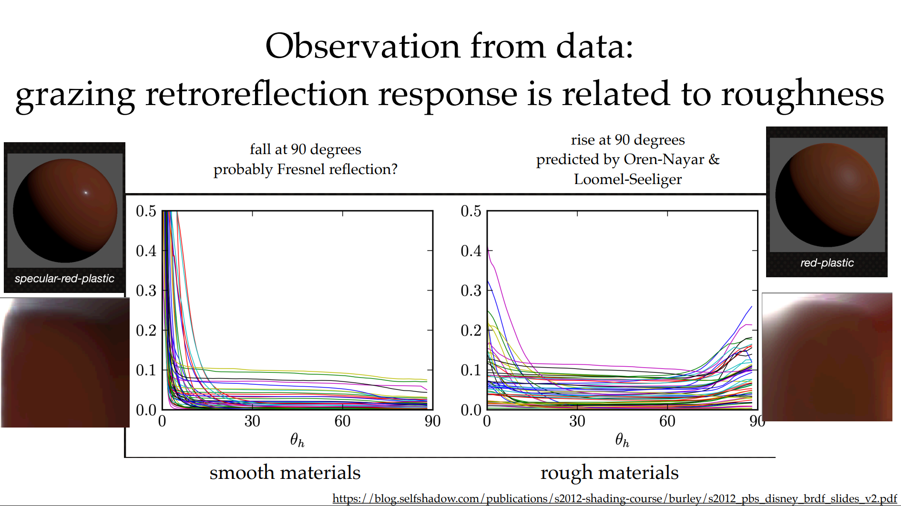
上述说的是，在 smooth 和  rough 不同的材质上，菲涅尔表现形式是不一样的。
与是，迪士尼改用一个 hack 将两种情况综合起来，因为传统 BRDF 要么用 Oren‑Nayar（专攻粗糙），要么用 Hanrahan‑Krueger（专攻内部散射），没有哪个公式能通过一个参数在两者之间连续过渡。
!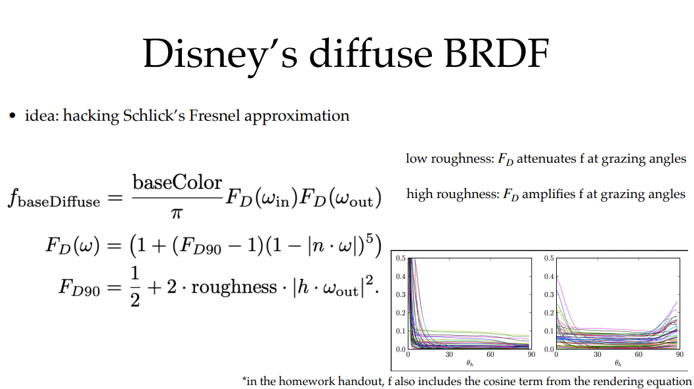
第一条公式使得两边对称，且乘以一个影响因子
第二条公式，则是依赖于 $\cos\theta$ 调节一个 范围为 1 到 $F_D$ 的一个取值
第三条公式，是通过调节 roughness 和 $h\  \omega_{out}$  调节 $F_D$ 的取值
!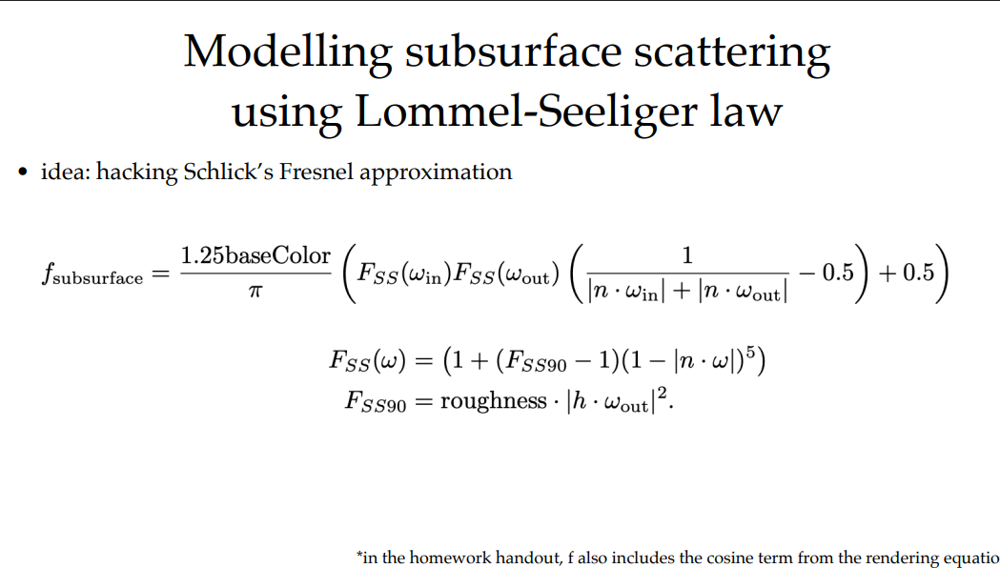
!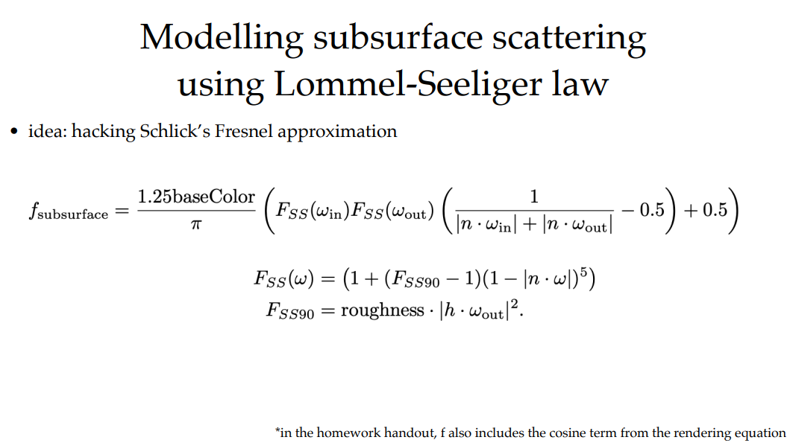
对于 subsurface 的主要核心内容和上述差不多
其中，公式一多出来的一部分为对投射核的修正具体情况为
**情景一：正入射 / 视角垂直**
$\cos\theta_i \approx 1,\cos\theta_o \approx 1 → T \approx 0.5$。
$T−0.5≈0$
无论 $F_{SS}$​ 是什么，乘积 $F_{SS}⋅F_{SS}⋅0=0$。
括号内只剩下 +0.5。
整个公式回退到稳定的 Lambertian 基底。

**情景二：掠射角 + 高粗糙度（粗糙材料边缘）**
$\cos\theta⁡_i \approx 0,\cos\theta⁡_o \approx 0 → T$ 很大。
$T−0.5$ 也很大。
同时，高粗糙度下 $F_{SS}$​ 较大（接近 1）。
乘积 $F_{SS}⋅F_{SS}⋅(T−0.5)$ 为正值增强项。
括号内 = 增强项 + 0.5 → 边缘变亮（透射感出现）。

**情景三：掠射角 + 低粗糙度（光滑材料边缘）**
$T$ 仍然很大。
但低粗糙度下 $F_{SS}$​ 很小（接近 0）。
乘积 $F_{SS}⋅F_{SS}⋅(T−0.5) → 被压缩到接近 0$。
$括号内 \approx 0 + 0.5 = 0.5$。
边缘不会因透射核而爆炸，被安全地拉回基线。
# metal 和 clearcoat BRDFs
如何用简单的参数表达复杂的高光
传统的单个 GGX 瓣（lobe）无法同时兼顾**锐利的核心高光**和**长距离衰减的模糊高光**。
解决思路
**Metal lobe（金属瓣）**：标准 GGX，负责**核心高光**。
**Clearcoat lobe（清漆瓣）**：另一个独立层，负责**长尾高光**。
下面是从 $D_{GGX}$ 到 $D_{clearcoar}$ 的区别
!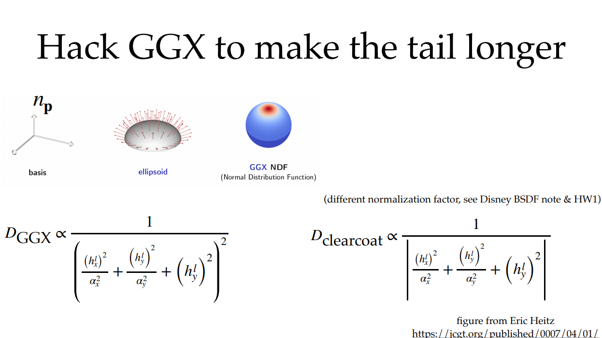
在这个公式下，获得了一个长尾的特性
!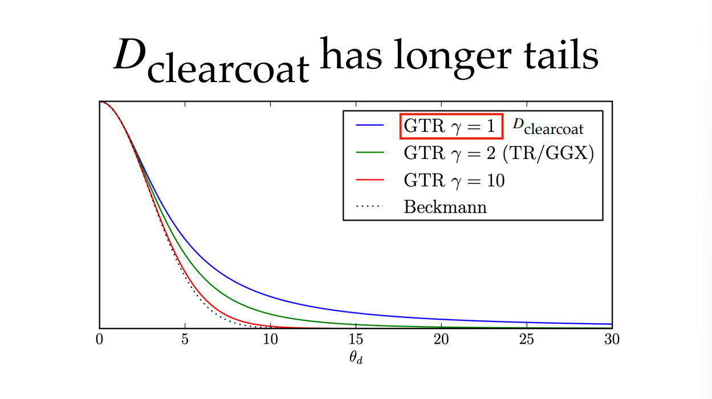
于是可以将其构造一个BRDF
下面这个是标准的 GGX 的 microfacet 模型
!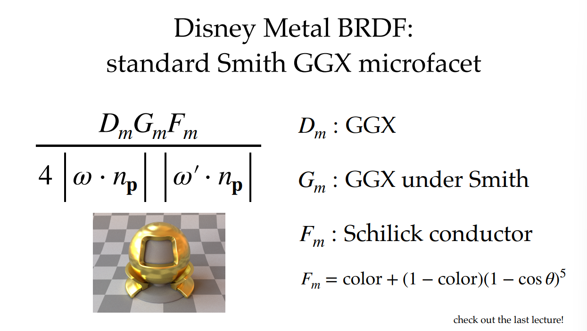
下面是 迪士尼 hack 后的 Clearcoat 模型
!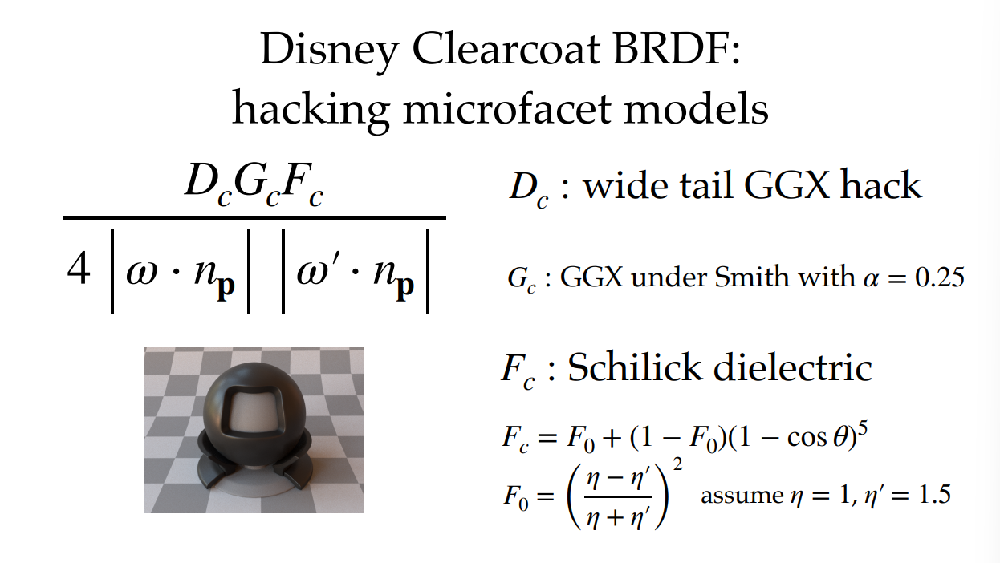

# glass BSDF
对于 glass BSDF 需要计算其折射和反射
!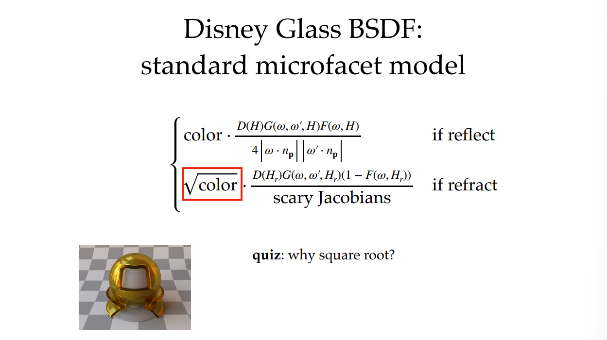
进入玻璃时，光从空气穿过表面，被吸收一次 → 能量被吸收 color 倍。
离开玻璃时，光从玻璃穿回空气，被吸收第二次 → 再被吸收 color 倍。
!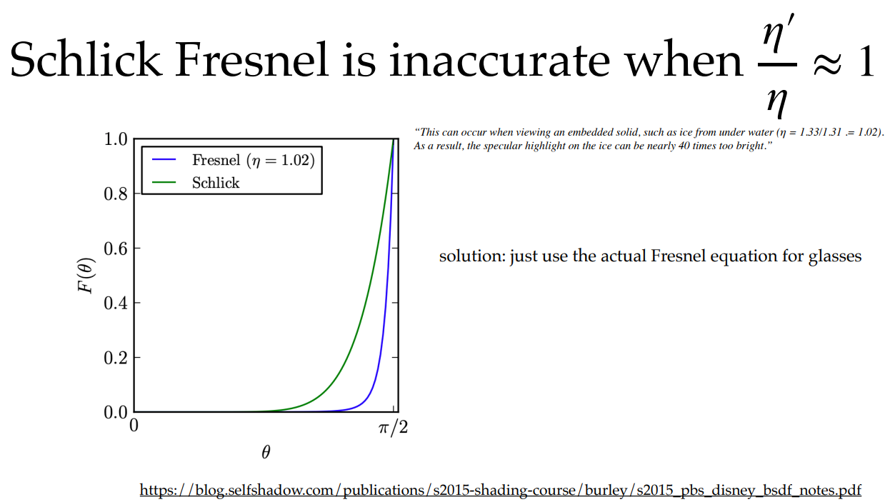
$$
F(\theta) = F_0 + (1 - F_0)(1 - \cos\theta)^5
$$
当 $\eta_1 \approx \eta_2$ 时，$F_0$ 非常小。但 Schlick 近似在掠射角（$\cos\theta⁡→0$）时总是趋向 1，无论 $F_0$ 是多少。这意味着它会错误地预测一个很强的边缘反射高光。
**迪士尼的解决方案**：  
对于玻璃/透明材质，放弃 Schlick 近似，使用完整的 Fresnel 方程。
完整 Fresnel 方程在折射率比值接近 1 时，掠射角的反射率也不会错误地飙到 1，而是正确地保持很低。
最直观的解释是，Schlick 近似在 $\theta$ 趋于 $\frac{\pi}{2}$ 时，其速度要快于 Fresnel 原本的速度，这就导致在比较特殊的场景时（当 $\eta_1 \approx \eta_2$ 时），会出问题。
# sheen（光泽/绒感层）BSDF
普通粗糙塑料中Fresnel 边缘光的颜色为：白色（无色），强度：由 Fresnel 方程决定
布料中Fresnel 边缘光的颜色为：带有材质本色（tinted），强度：比同等粗糙度的塑料更强
**物理成因**：  
布料表面由无数细小的纤维（fibers）组成。这些纤维的直径通常只有几微米到几十微米，在微观尺度上它们是微小的圆柱体，而非微面元模型假设的“小平镜”。
光线在纤维之间反复散射、衍射。
在掠射角，这些纤维像无数根半透明的“光管”，将光线沿着纤维方向传导，产生一种带颜色的、较强的边缘辉光。
!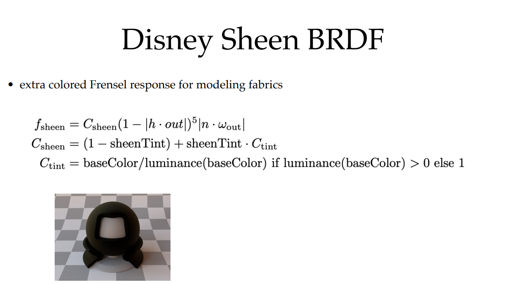
其中 
$$
luminance(C) = 0.2126 \ ·\  R + 0.7152 \ ·\  G + 0.0722 \ ·\ B
$$
在上述图片三条公式的最后一条，其作用相当于将 baseColor 的亮度归一化
中间那条，就是在 1 和 $C_{tint}$做插值
$sheenTint = 0$：$C_{sheen}=1$，即白色边缘光泽（适合黑丝绒、纯白棉布）。
$sheenTint = 1$：$C_{sheen}=C_{tint}$​，即边缘光泽染上材质的本色（适合彩色天鹅绒、红色绸缎）。
即，得到的 $C_{sheen}$ 控制颜色与染色
第一条公式中的 $(1 - |h · \omega_{out}|)^5$ 决定关泽在什么方向上可见
标准 Fresnel 用 $(1−\cos\theta)^5$，在整个表面的边缘都亮。
迪士尼 Sheen 用 $(1−∣h⋅\omega_{out}∣)^5$，在背向光源的边缘最亮。这模拟了布料纤维在逆光方向泛出柔和光泽的现象。
即，$\cos\theta_{out}$ 越大，其 sheen 项越大
剩下的 $|n · \omega_{out}|$ 代表视线越平行于表面，由于布料本身的几何遮挡关系，应该让Sheen 的贡献越小
# 迪士尼 BSDF 组合
!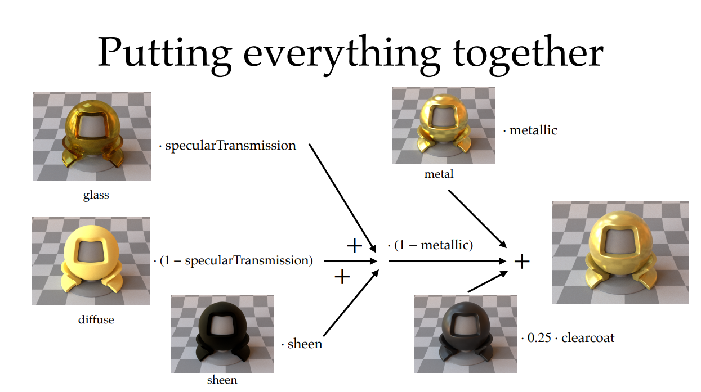
# Autodesk Standard Surface
!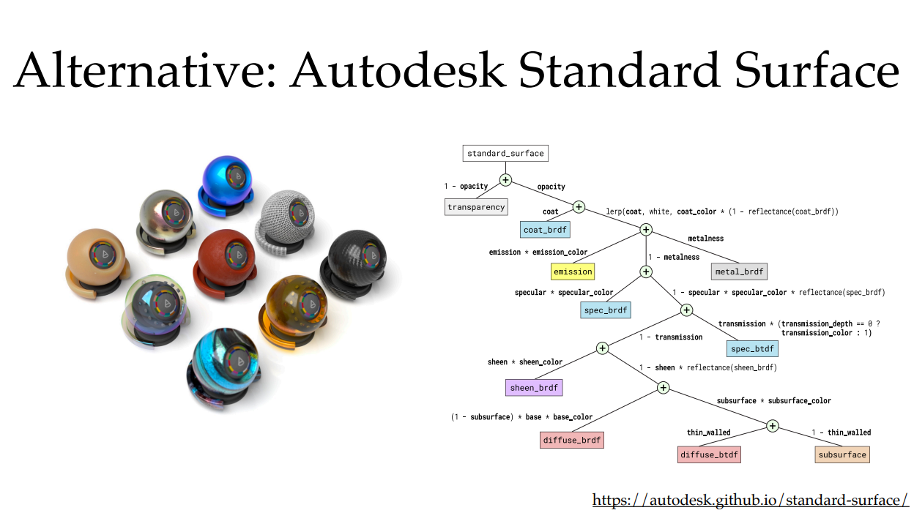
!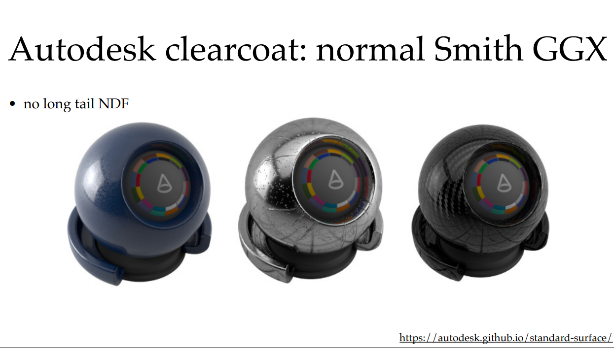
!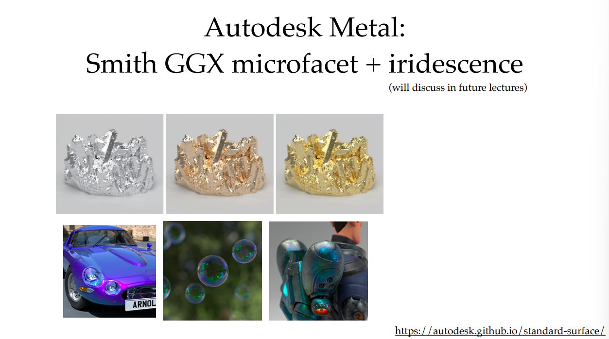
!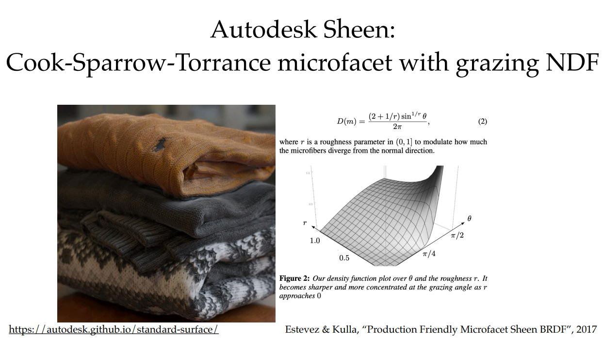
该模型和迪士尼的不同，
在 clearcoat 材质 上使用的是非 hack 后的 long tail NDF，而是原本的 NDF
在 Metal 材质 上，是由 Smith GGX microfacet + iridescence
在 Sheen 材质 上，是Cook-Sparrow-Torrance microfacet with grazing NDF

UE4 的 材质上，深受迪士尼的启发，但细节任有不同
!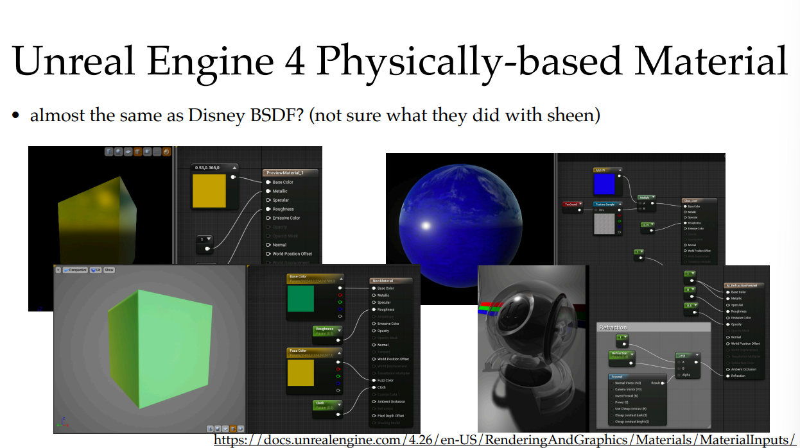
