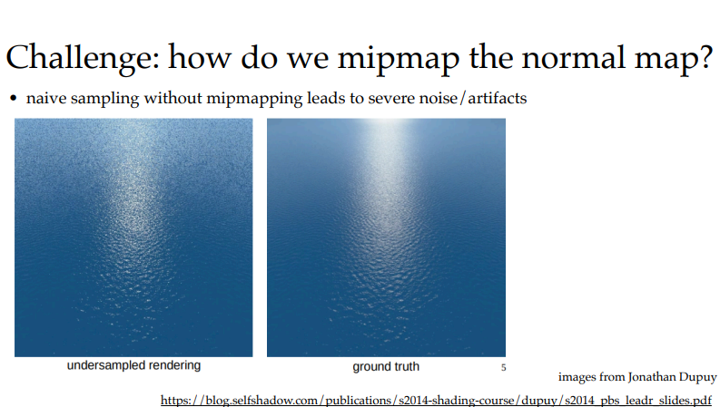
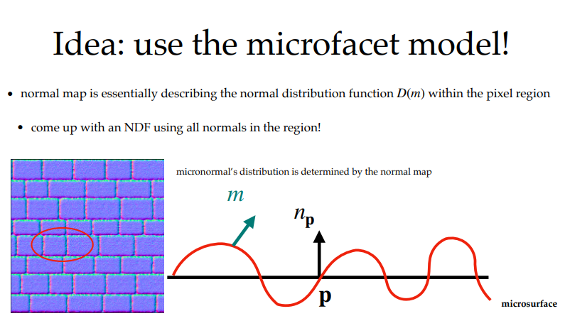
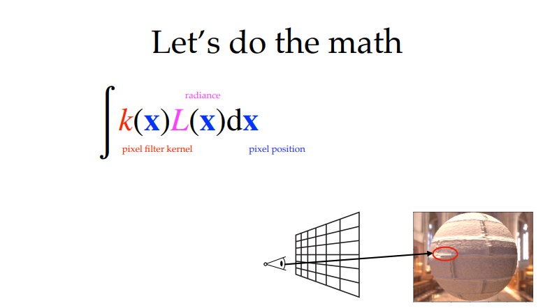
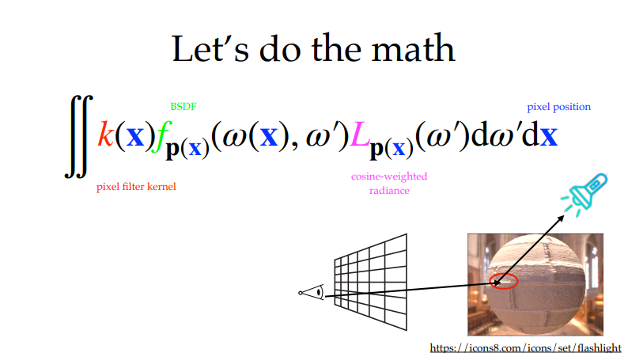
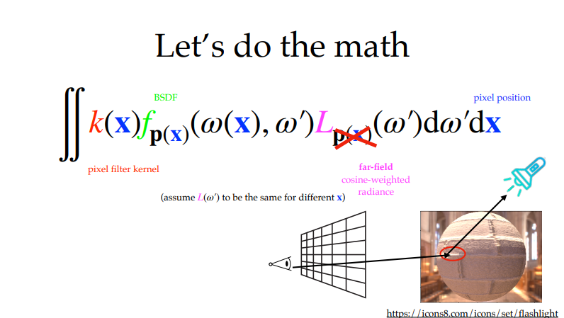
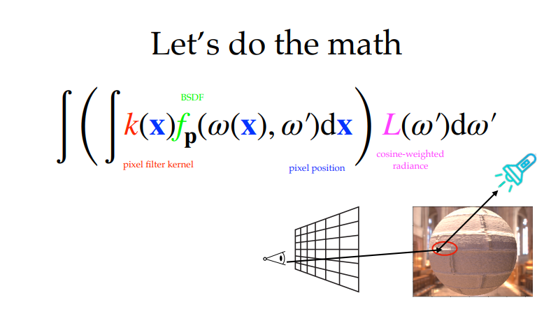
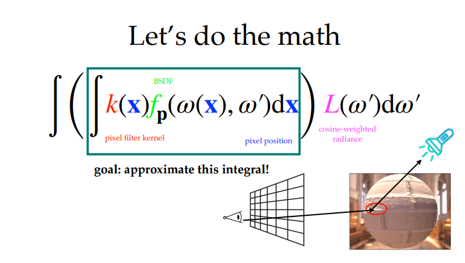
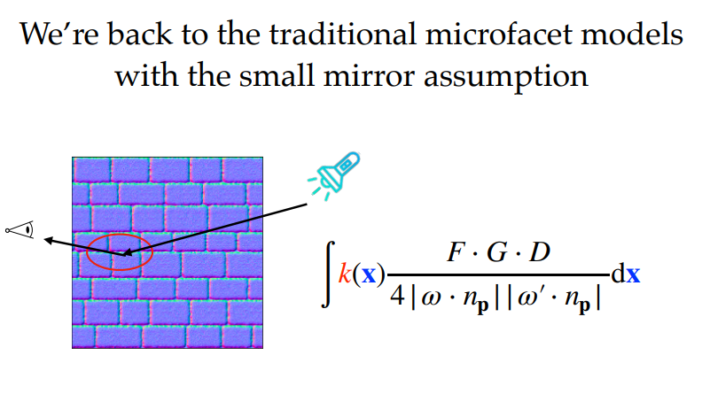
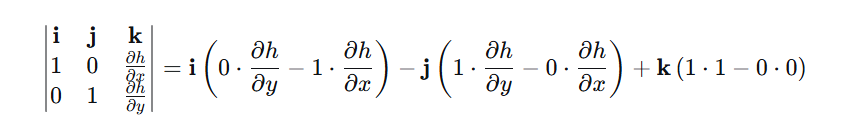
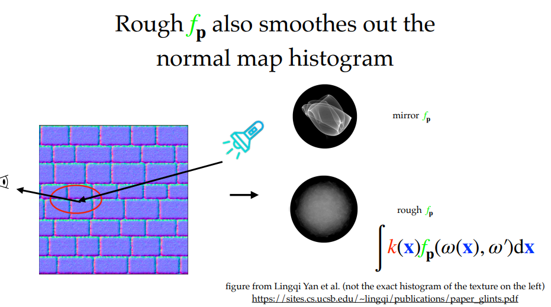

# introduction
顾名思义，这个 slider 主要说的是，如何对 normal texture 进行加工（生成 mipmap）
# 遇到的问题
!
就和 mipmap 提出时遇到的一样，在远处的高光，如果没有一个方式进行对 normal 的 mipmap 生成的话，在一些场景下高光会出问题
# Idea: use the microfacet model
!
一个非常符合直觉的想法，既然直接求平均不行，那么我获取其 NDF 然后进行数学上的加工即可。又或者说，在远处高光地区其形式上特别符合微表面模型。（但很显然，如果直接使用微表面模型的话，肯定也会遇到和微表面模型一样的问题，例如能量的损失等等）
## 进行数学的推导
!
显然对于每一个 pixel 来说，其到人眼的光照（能量）为一个积分
$$
\int k(x)L(x)\ dx
$$
其中 
$$
k(x) \  为对于每一个 \ pixel\  而言在对应的 S 上的滤波核
$$
$$
L(x) \ 为\ dS\  上接受到的 \ radiance
$$
!
对上述方程展开就变成
$$
\iint k(x)f_{p(x)}(\omega(x), \omega')L_{p(x)}(\omega')\ d\omega'dx
$$
其实际为，在常见的渲染方程里面，乘以一个 $k(x)$ 并在 $pixel$ 上做一次积分
!
将不考虑 $L_{p(x)}(\omega')$ 上与 $p(x)$ 相关性，即假设在这个区域内场景着色点所收到的 $radiance$ 是一致的。
即假设 $dS$（我认为的 $pixel$ 覆盖的面积）于场景相交得到一个 $dS'$ 这个 $dS'$ 上的每一点接受的 $L(\omega)$ 都是一样的。但实际上物理层面来说是不一样的。再换句话来说，其 $dS'$ 的入射光假设为一个 $SH$ 函数集， 就是假设其 $SH$ 的系数都是一样的。
这一步为的是将 “空间变化光照 × 空间变化 BSDF” 的全耦合积分，改变为 法线分布引起的 BSDF 变化的积分上
于是原本的积分可以优化为
$$
\iint k(x)f_{p(x)}(\omega(x), \omega')L(\omega')\ d\omega' dx
$$
既然我们将积分改变为 法线分布引起的 BSDF 变化的积分，那么下一步理所当然将解耦合的部分提出去
!
$$
\int \left(\int k(x)f_p(\omega(x), \omega')dx \right) L(\omega')d\omega'
$$
那么下一步的做法也很明确了
!
估计里面积分的内容
$$
\int k(x)f_p(\omega(x),\omega')dx
$$
如果直接对这个范围的点进行暴力积分的话会很昂贵，因为每一点其可能是覆盖法线贴图成百上千个法线贴图像素
同时，如果想要利用 microfacet 模型的话，其自变量应该为 rough 而不是 x 
那么假设某一点其微表面的 NDF 函数为 法线贴图
那么对于某一点覆盖的法线贴图范围内，如果其 NDF 分布杂乱，则 roughness 比较大，反之则小
最后再假设 $f_p(\omega(x), \omega')$ 为微小的镜子组合（即微表面模型的基础假设），则其可以满足微表面模型的公式
!
即回到最基础的微表面模型积分
$$
\int k(x) \frac{F · G · D}{4 \ |\omega · n_p| \ |\omega'· n_p|} dx
$$
其 $D$ 为 normal map 表示
### 法线分布直方图(histogram)
法线贴图：每个纹素存一个法线方向 $n=(n_x,n_y,n_z)$，通常会被转换成斜率坐标更方便处理：
$$
\hat{n}_x = \frac{n_x}{n_z}, \qquad \hat{n}_y = \frac{n_y}{n_z}
$$

原因，$||n|| = 1$, 实际上 $n$ 只有两个自由度， $n_z$ 进行等于1 处理
直方图：把像素区域内的所有纹素的 $(n_x,n_y)$ 收集起来，统计每种斜率组合出现的次数（或频率）。

**这里简单解释一下微表面模型的一些内容**
##### 微表面 = 高度场
微表面模型最常用的基本假设是：宏观表面是一个平面 $(z=0)$ ，而微表面是叠加在这个平面上的高度场（heightfield）。  
用一个函数 $h(x,y)$ 描述微表面的高度，即点 $(x,y)$ 处的微观高度是 $z=h(x,y)$。

这个高度场上的任意一点，其局部形状由两个切线方向决定：
$$
t_x=(1, 0, \frac{∂h}{∂x}), \qquad t_y=(0, 1, \frac{∂h}{∂y})
$$
这两个向量的方向就是“沿 x 方向走”和“沿 y 方向走”时表面起伏的切线。
##### 从高度场到微表面法线
微表面的法线 mm 垂直于这两个切向量，用叉积得到：
$$
m_{unnormalized} = t_x \times t_y = (-\frac{\partial h}{\partial x}, - \frac{\partial h}{\partial y}, 1)
$$
叉积计算：
其中：
!
结果是 $(−\frac{∂h}{∂x}, −\frac{∂h}{∂y}, 1)$。  
它的 $z$ 分量为正 $(+1)$ ，意味着法线默认指向 $+z$ 半球，即朝向观察者方向（宏观法线）。这正符合我们对微表面“朝向外面”的约定。
将上述结果归一化，就得到单位法线：
$$
m = \frac{(-\frac{\partial h}{\partial x}, -\frac{\partial h}{\partial y}, 1)}{\sqrt{(\frac{\partial h}{\partial x})^2+(\frac{\partial h}{\partial y})^2+1}}
$$
于是法线各个分量的比例为
$$
m_x : m_y : m_z = -\frac{\partial h}{\partial x} : -\frac{\partial h}{\partial y} : 1
$$
即对于任何一个法线向量 $m = (m_x, m_y, m_z)$，其中 $(m_z > 0)$ 有
$$
\frac{\partial h}{\partial x} = -\frac{m_x}{m_z}, \qquad \frac{\partial h}{\partial y} = - \frac{m_y}{m_z}
$$
那么可以对应到直方图了
$$
\hat{m}_x = \frac{m_x}{m_z}, \qquad \hat{m}_y = \frac{m_y}{m_z}
$$

其中天然有
$$
\frac{\partial h}{\partial x} = - \hat{m}_x, \qquad \frac{\partial h}{\partial y} = - \hat{m}_y
$$
对于 Beckmann 模型，认为微观几何的斜率服从高斯分布即
$$
P(\hat{m}_x, \hat{m}_y) \propto \exp \left( - \frac{1}{2} \left[ \frac{\hat{m}_x^2}{\alpha_x^2} + \frac{\hat{m}_y^2}{\alpha_y^2} \right]  \right)
$$
## 继续进行数学的推导
!
有了以上的背景知识，这边对于 $mirror f_p 和 rough f_p$ 的直方图应该能看懂了
## Recall: Beckmann NDF
继续补充 microfacet 相关数学:
联系微表面的真实面积 $dA_{micro}$ 与投影面积 $dA$ 即
$$
dA_{micro} = D(m) \ d\omega_m dA
$$
其中，代表为某个面积 $dA$ 的某个方向角 $d\omega$ 上法线为 $m$ 的实际面积为 $dA_{micro}$
也就是一个测度 $dA$ 是面积微元上，另一个测度 $d\omega$ 为方向角微元上
对于斜率 $\zeta = (\frac{m_x}{m_z}, \frac{m_y}{m_z})$
斜率落在 $d\zeta_x d\zeta_y$ 微元内的概率是 $P(\zeta) d\zeta_x d\zeta_y$
相当于在该面积微元 $dA$ 内，斜率落在 $d\zeta_x d\zeta_y$ 上的比例为 $P(\zeta)$
$\frac{dA}{m_z}$ 为某个面积 $dA$ 上法线全为 $m$ 时的实际面积
故 $\frac{dA}{m_Z}P(\zeta)d\zeta_x d\zeta_y$ 为某个面积 $dA$ 上法线为 $m$ 的实际面积即为 $dA_{micro}$
故有
$$
D(m)d\omega_m dA = dA_{micro} = \frac{dA}{m_z}P(\zeta)d\zeta_x d\zeta_y
$$
$$
D(m)d\omega_m dA = \frac{P(\zeta)d\zeta_xd\zeta_y}{m_z}dA
$$
$$
D(m)d\omega_m = \frac{P(\zeta)d\zeta_xd\zeta_y}{m_z}, \qquad (m·n) = m_z
$$
如此，
$$
D(m) = \frac{P(\zeta)}{m_z} · \frac{d\zeta_x d\zeta_y}{d\omega_m}
$$
显然对于 $d\zeta_x d\zeta_y$ 到 $d\omega_m$  存在行列式 $J$ 使得 $d\zeta_x d\zeta_y = |J|· d\omega_m$ 
故上式可化简为 
$$
D(m) = \frac{P(\zeta)}{m_z} · |J|
$$
下面求 $J$ 
对于 $m = (m_x, m_y, m_z)$ 有
$$
m_x = \sin\theta \cos\phi, \qquad m_y = \sin\theta\sin\phi, \qquad m_z = \cos\theta
$$
对于 $\zeta = (\zeta_x, \zeta_y)$ 有
$$
\zeta_x = \frac{m_x}{m_z}, \qquad \zeta_y = \frac{m_y}{m_z}
$$
故有
$$
\zeta_x = \tan\theta cos\phi, \qquad \zeta_y = \tan\theta\sin\phi
$$
同时 
$$
d\omega_m = \sin\theta d\theta d\phi
$$
故有
$$
d\zeta_x d\zeta_y = |J| d\omega_m = |J| \sin\theta d\theta d\phi
$$
故存在 $J'$ 使得
$$
d\zeta_x d\zeta_y = |J'| d\theta\ d\phi, \qquad同时有\ |J'| = |J|\sin\theta
$$
故转换求 $J'$
即求 
$$
J' = 
\Large
\begin{vmatrix}
\frac{\partial(\zeta_x, \zeta_y)}{\partial(\theta, \phi)}
\end{vmatrix}
 = 
\begin{vmatrix}
\frac{\partial \zeta_x}{\partial \theta} & \frac{\partial \zeta_x}{\partial \phi} \\
\frac{\partial \zeta_y}{\partial \theta} & \frac{\partial \zeta_y}{\partial \phi}
\end{vmatrix}
=
\begin{vmatrix}
\frac{1}{\cos^2\theta}\cos\phi & - \tan\theta\sin\phi\\
\frac{1}{\cos^2\theta}\sin\phi & \tan\theta\cos\phi
\end{vmatrix}
$$
即
$$
J' = \frac{1}{\cos^2\theta}\tan\theta\  \cos^2\phi \ +\  \frac{1}{\cos^2\theta} \tan\theta \ \sin^2\phi = \frac{\sin\theta}{\cos^3\theta} = \frac{\sin\theta}{m_z^3}
$$
由于
$$
|J'| = \left| \frac{sin\theta}{m_z^3} \right| = |\sin\theta J|
$$
故
$$
|J| = \left| \frac{1}{m_z^3} \right|
$$
又
$$
D(m) = \frac{P(\zeta)}{m_z} · |J|
$$
$(\theta, \  \phi)$ 取上半球故
$$
D(m) =\frac{P(\zeta)}{m_z} · \frac{1}{m_z^3} = \frac{P(\zeta)}{m_z^4}
$$
故
$$
D(m) = \frac{1}{m_z^4}P(\frac{m_x}{m_z}, \frac{m_y}{m_z})
$$
对于独立高斯斜率有
$$
P(\zeta_x, \zeta_y) = \frac{1}{2\pi \alpha_x \alpha_y} exp\left[ -\frac{1}{2}\left( \frac{\zeta_x^2}{\alpha_x^2} \ +\ \frac{\zeta_y^2}{\alpha_y^2} \right) \right]
$$
带入上式有
$$
D(m) = \frac{1}{2\pi \alpha_x \alpha_y m_z^4} exp\left[ -\frac{1}{2m_z^2}\left( \frac{m_x^2}{\alpha_x^2} \ +\ \frac{m_y^2}{\alpha_y^2} \right) \right]
$$
**对于多元正太分布公式为**
$$
p(\zeta) = \frac{1}{2\pi\sqrt{\det \Sigma}} \exp{\left[ - \frac{1}{2}(\zeta - N)^\mathsf{T} \Sigma^{-1}(\zeta - N) \right]}
$$
其中二元的情况为
$$
\Sigma = 
\begin{pmatrix}
\alpha_x^2 & \alpha_{xy} \\
\alpha_{xy} & \alpha_y^2
\end{pmatrix} , \qquad
det \ \Sigma = 
\begin{vmatrix}
\alpha_x^2 & \alpha_{xy} \\
\alpha_{xy} & \alpha_y^2
\end{vmatrix}
= \alpha_x^2\alpha_y^2 - \alpha_{xy}^2
$$
故 
$$
\Sigma^{-1} = \frac{1}{\det\ \Sigma}
\begin{pmatrix}
\alpha_y^2 & -\alpha_{xy} \\
-\alpha_{xy} & \alpha_x^2
\end{pmatrix}
$$
这时，我们终于拿到**off‑centered Beckmann NDF**的公式了
$$
\text 随机向量：
\zeta = 
\begin{pmatrix}
\zeta_x \\
\zeta_y
\end{pmatrix}
$$
$$
\text 均值向量：
N = 
\begin{pmatrix}
N_x \\
N_y
\end{pmatrix}
$$
$$
\text 协方差矩阵：
\Sigma = 
\begin{pmatrix}
\alpha_x^2 & \alpha_{xy} \\
\alpha_{xy} & \alpha_y^2
\end{pmatrix}
$$
带入公式
$$
p(\zeta) = \frac{1}{2\pi\sqrt{\det \Sigma}} \exp{\left[ - \frac{1}{2}(\zeta - N)^\mathsf{T} \Sigma^{-1}(\zeta - N) \right]}
$$
$$
p(\zeta) = \frac{1}{2\pi \sqrt{\alpha_x^2\alpha_y^2 - \alpha_{xy}^2}} \exp{\left( 
- \frac{1}{2}

\begin{bmatrix}
\zeta_x - N_x & \zeta_y - N_y
\end{bmatrix}

\begin{bmatrix}
\alpha_x^2 & \alpha_{xy} \\
\alpha_{xy} & \alpha_y^2
\end{bmatrix}^{-1}

\begin{bmatrix}
\zeta_x - N_x \\ 
\zeta_y - N_y
\end{bmatrix}

\right)}
$$
即
$$
p(\zeta) = \frac{1}{2\pi \sqrt{\alpha_x^2\alpha_y^2 - \alpha_{xy}^2}} \exp{\left( 
- \frac{1}{2}

\begin{bmatrix}
\frac{m_x}{m_z} - N_x & \frac{m_y}{m_z} - N_y
\end{bmatrix}

\begin{bmatrix}
\alpha_x^2 & \alpha_{xy} \\
\alpha_{xy} & \alpha_y^2
\end{bmatrix}^{-1}

\begin{bmatrix}
\frac{m_x}{m_z} - N_x \\ 
\frac{m_y}{m_z} - N_y
\end{bmatrix}

\right)}
$$

