# introduction
顾名思义，这个 slider 主要说的是，如何对 normal texture 进行加工（生成 mipmap）
# 遇到的问题
!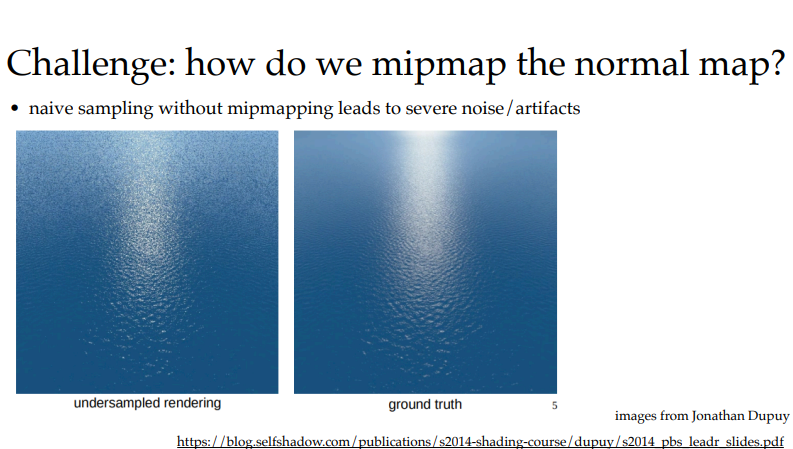
就和 mipmap 提出时遇到的一样，在远处的高光，如果没有一个方式进行对 normal 的 mipmap 生成的话，在一些场景下高光会出问题
# Idea: use the microfacet model
!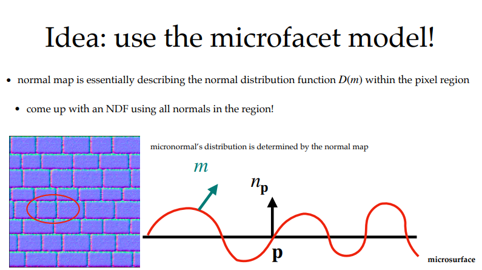
一个非常符合直觉的想法，既然直接求平均不行，那么我获取其 NDF 然后进行数学上的加工即可。又或者说，在远处高光地区其形式上特别符合微表面模型。（但很显然，如果直接使用微表面模型的话，肯定也会遇到和微表面模型一样的问题，例如能量的损失等等）
## 进行数学的推导
!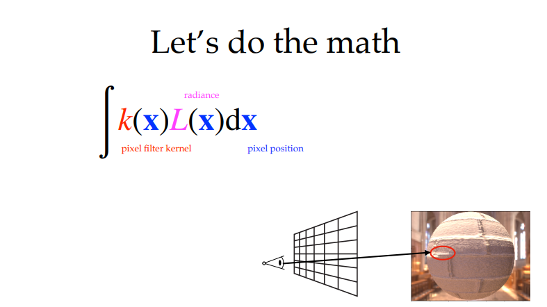
显然对于每一个 pixel 来说，其到人眼的光照（能量）为一个积分
$$
\int k(x)L(x)\ dx
$$
其中 
$$
k(x) \  为对于每一个 \ pixel\  而言在对应的 S 上的滤波核
$$
$$
L(x) \ 为\ dS\  上接受到的 \ radiance
$$
!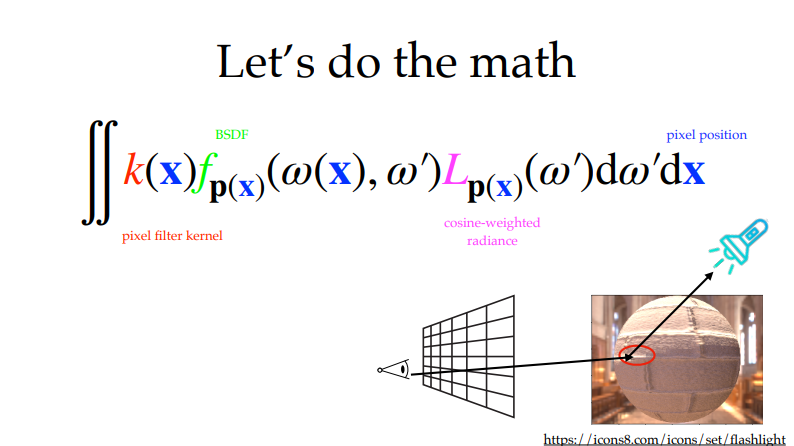
对上述方程展开就变成
$$
\iint k(x)f_{p(x)}(\omega(x), \omega')L_{p(x)}(\omega')\ d\omega'dx
$$
其实际为，在常见的渲染方程里面，乘以一个 $k(x)$ 并在 $pixel$ 上做一次积分
!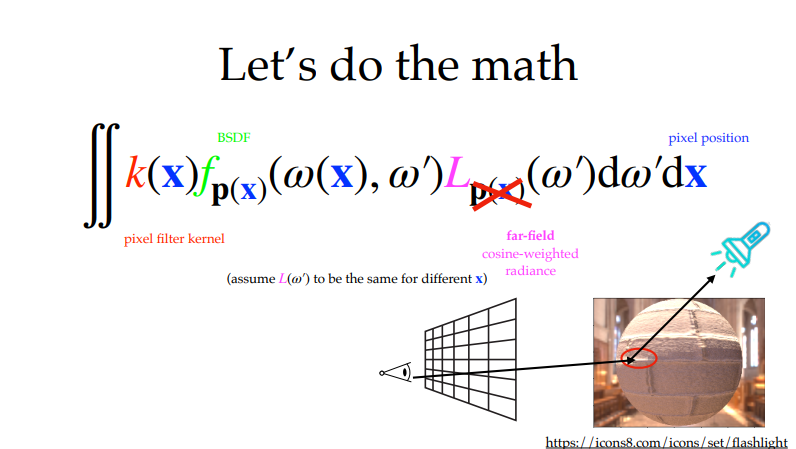
将不考虑 $L_{p(x)}(\omega')$ 上与 $p(x)$ 相关性，即假设在这个区域内场景着色点所收到的 $radiance$ 是一致的。
即假设 $dS$（我认为的 $pixel$ 覆盖的面积）于场景相交得到一个 $dS'$ 这个 $dS'$ 上的每一点接受的 $L(\omega)$ 都是一样的。但实际上物理层面来说是不一样的。再换句话来说，其 $dS'$ 的入射光假设为一个 $SH$ 函数集， 就是假设其 $SH$ 的系数都是一样的。
这一步为的是将 “空间变化光照 × 空间变化 BSDF” 的全耦合积分，改变为 法线分布引起的 BSDF 变化的积分上
于是原本的积分可以优化为
$$
\iint k(x)f_{p(x)}(\omega(x), \omega')L(\omega')\ d\omega' dx
$$
既然我们将积分改变为 法线分布引起的 BSDF 变化的积分，那么下一步理所当然将解耦合的部分提出去
!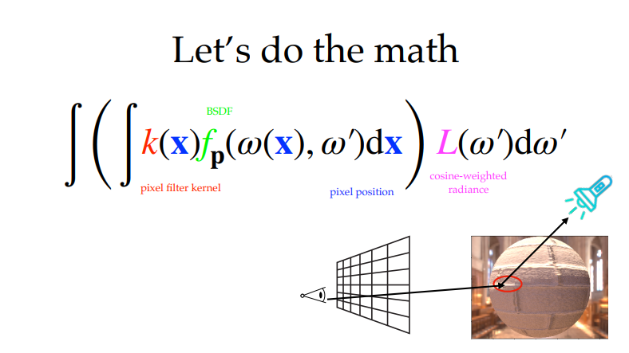
$$
\int \left(\int k(x)f_p(\omega(x), \omega')dx \right) L(\omega')d\omega'
$$
那么下一步的做法也很明确了
!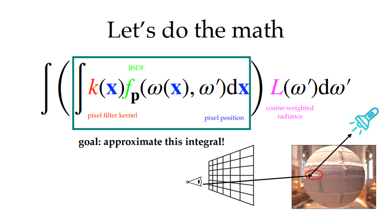
估计里面积分的内容
$$
\int k(x)f_p(\omega(x),\omega')dx
$$
如果直接对这个范围的点进行暴力积分的话会很昂贵，因为每一点其可能是覆盖法线贴图成百上千个法线贴图像素
同时，如果想要利用 microfacet 模型的话，其自变量应该为 rough 而不是 x 
那么假设某一点其微表面的 NDF 函数为 法线贴图
那么对于某一点覆盖的法线贴图范围内，如果其 NDF 分布杂乱，则 roughness 比较大，反之则小
最后再假设 $f_p(\omega(x), \omega')$ 为微小的镜子组合（即微表面模型的基础假设），则其可以满足微表面模型的公式
!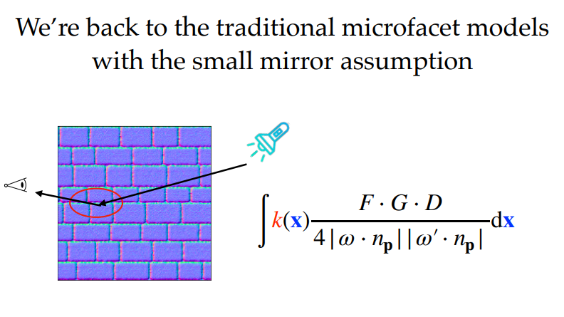
即回到最基础的微表面模型积分
$$
\int k(x) \frac{F · G · D}{4 \ |\omega · n_p| \ |\omega'· n_p|} dx
$$
其 $D$ 为 normal map 表示
### 法线分布直方图(histogram)
法线贴图：每个纹素存一个法线方向 $n=(n_x,n_y,n_z)$，通常会被转换成斜率坐标更方便处理：
$$
\hat{n}_x = \frac{n_x}{n_z}, \qquad \hat{n}_y = \frac{n_y}{n_z}
$$

原因，$||n|| = 1$, 实际上 $n$ 只有两个自由度， $n_z$ 进行等于1 处理
直方图：把像素区域内的所有纹素的 $(n_x,n_y)$ 收集起来，统计每种斜率组合出现的次数（或频率）。

**这里简单解释一下微表面模型的一些内容**
##### 微表面 = 高度场
微表面模型最常用的基本假设是：宏观表面是一个平面 $(z=0)$ ，而微表面是叠加在这个平面上的高度场（heightfield）。  
用一个函数 $h(x,y)$ 描述微表面的高度，即点 $(x,y)$ 处的微观高度是 $z=h(x,y)$。

这个高度场上的任意一点，其局部形状由两个切线方向决定：
$$
t_x=(1, 0, \frac{∂h}{∂x}), \qquad t_y=(0, 1, \frac{∂h}{∂y})
$$
这两个向量的方向就是“沿 x 方向走”和“沿 y 方向走”时表面起伏的切线。
##### 从高度场到微表面法线
微表面的法线 mm 垂直于这两个切向量，用叉积得到：
$$
m_{unnormalized} = t_x \times t_y = (-\frac{\partial h}{\partial x}, - \frac{\partial h}{\partial y}, 1)
$$
叉积计算：
其中：
$$
\begin{vmatrix}
i & j& k \\
1 & 0 & \frac{\partial h}{\partial x} \\
0 & 1 & \frac{\partial h}{\partial y}
\end{vmatrix}
= i \left( 0 · \frac{\partial h}{\partial y} - 1 · \frac{\partial h}{\partial x} \right) - j \left( 1 · \frac{\partial h}{\partial y} - 0 · \frac{\partial h}{\partial x} \right) + k(1 · 1 - 0· 0)
$$
结果是 $(−\frac{∂h}{∂x}, −\frac{∂h}{∂y}, 1)$。  
它的 $z$ 分量为正 $(+1)$ ，意味着法线默认指向 $+z$ 半球，即朝向观察者方向（宏观法线）。这正符合我们对微表面“朝向外面”的约定。
将上述结果归一化，就得到单位法线：
$$
m = \frac{(-\frac{\partial h}{\partial x}, -\frac{\partial h}{\partial y}, 1)}{\sqrt{(\frac{\partial h}{\partial x})^2+(\frac{\partial h}{\partial y})^2+1}}
$$
于是法线各个分量的比例为
$$
m_x : m_y : m_z = -\frac{\partial h}{\partial x} : -\frac{\partial h}{\partial y} : 1
$$
即对于任何一个法线向量 $m = (m_x, m_y, m_z)$，其中 $(m_z > 0)$ 有
$$
\frac{\partial h}{\partial x} = -\frac{m_x}{m_z}, \qquad \frac{\partial h}{\partial y} = - \frac{m_y}{m_z}
$$
那么可以对应到直方图了
$$
\hat{m}_x = \frac{m_x}{m_z}, \qquad \hat{m}_y = \frac{m_y}{m_z}
$$

其中天然有
$$
\frac{\partial h}{\partial x} = - \hat{m}_x, \qquad \frac{\partial h}{\partial y} = - \hat{m}_y
$$
对于 Beckmann 模型，认为微观几何的斜率服从高斯分布即
$$
P(\hat{m}_x, \hat{m}_y) \propto \exp \left( - \frac{1}{2} \left[ \frac{\hat{m}_x^2}{\alpha_x^2} + \frac{\hat{m}_y^2}{\alpha_y^2} \right]  \right)
$$
## 继续进行数学的推导
!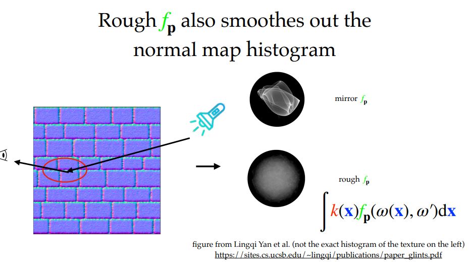
有了以上的背景知识，这边对于 $mirror f_p 和 rough f_p$ 的直方图应该能看懂了
## Recall: Beckmann NDF
继续补充 microfacet 相关数学:
联系微表面的真实面积 $dA_{micro}$ 与投影面积 $dA$ 即
$$
dA_{micro} = D(m) \ d\omega_m dA
$$
其中，代表为某个面积 $dA$ 的某个方向角 $d\omega$ 上法线为 $m$ 的实际面积为 $dA_{micro}$
也就是一个测度 $dA$ 是面积微元上，另一个测度 $d\omega$ 为方向角微元上
对于斜率 $\zeta = (\frac{m_x}{m_z}, \frac{m_y}{m_z})$
斜率落在 $d\zeta_x d\zeta_y$ 微元内的概率是 $P(\zeta) d\zeta_x d\zeta_y$
相当于在该面积微元 $dA$ 内，斜率落在 $d\zeta_x d\zeta_y$ 上的比例为 $P(\zeta)$
$\frac{dA}{m_z}$ 为某个面积 $dA$ 上法线全为 $m$ 时的实际面积
故 $\frac{dA}{m_Z}P(\zeta)d\zeta_x d\zeta_y$ 为某个面积 $dA$ 上法线为 $m$ 的实际面积即为 $dA_{micro}$
故有
$$
D(m)d\omega_m dA = dA_{micro} = \frac{dA}{m_z}P(\zeta)d\zeta_x d\zeta_y
$$
$$
D(m)d\omega_m dA = \frac{P(\zeta)d\zeta_xd\zeta_y}{m_z}dA
$$
$$
D(m)d\omega_m = \frac{P(\zeta)d\zeta_xd\zeta_y}{m_z}, \qquad (m·n) = m_z
$$
如此，
$$
D(m) = \frac{P(\zeta)}{m_z} · \frac{d\zeta_x d\zeta_y}{d\omega_m}
$$
显然对于 $d\zeta_x d\zeta_y$ 到 $d\omega_m$  存在行列式 $J$ 使得 $d\zeta_x d\zeta_y = |J|· d\omega_m$ 
故上式可化简为 
$$
D(m) = \frac{P(\zeta)}{m_z} · |J|
$$
下面求 $J$ 
对于 $m = (m_x, m_y, m_z)$ 有
$$
m_x = \sin\theta \cos\phi, \qquad m_y = \sin\theta\sin\phi, \qquad m_z = \cos\theta
$$
对于 $\zeta = (\zeta_x, \zeta_y)$ 有
$$
\zeta_x = \frac{m_x}{m_z}, \qquad \zeta_y = \frac{m_y}{m_z}
$$
故有
$$
\zeta_x = \tan\theta cos\phi, \qquad \zeta_y = \tan\theta\sin\phi
$$
同时 
$$
d\omega_m = \sin\theta d\theta d\phi
$$
故有
$$
d\zeta_x d\zeta_y = |J| d\omega_m = |J| \sin\theta d\theta d\phi
$$
故存在 $J'$ 使得
$$
d\zeta_x d\zeta_y = |J'| d\theta\ d\phi, \qquad同时有\ |J'| = |J|\sin\theta
$$
故转换求 $J'$
即求 
$$
J' = 
\Large
\begin{vmatrix}
\frac{\partial(\zeta_x, \zeta_y)}{\partial(\theta, \phi)}
\end{vmatrix}
 = 
\begin{vmatrix}
\frac{\partial \zeta_x}{\partial \theta} & \frac{\partial \zeta_x}{\partial \phi} \\
\frac{\partial \zeta_y}{\partial \theta} & \frac{\partial \zeta_y}{\partial \phi}
\end{vmatrix}
=
\begin{vmatrix}
\frac{1}{\cos^2\theta}\cos\phi & - \tan\theta\sin\phi\\
\frac{1}{\cos^2\theta}\sin\phi & \tan\theta\cos\phi
\end{vmatrix}
$$
即
$$
J' = \frac{1}{\cos^2\theta}\tan\theta\  \cos^2\phi \ +\  \frac{1}{\cos^2\theta} \tan\theta \ \sin^2\phi = \frac{\sin\theta}{\cos^3\theta} = \frac{\sin\theta}{m_z^3}
$$
由于
$$
|J'| = \left| \frac{sin\theta}{m_z^3} \right| = |\sin\theta J|
$$
故
$$
|J| = \left| \frac{1}{m_z^3} \right|
$$
又
$$
D(m) = \frac{P(\zeta)}{m_z} · |J|
$$
$(\theta, \  \phi)$ 取上半球故
$$
D(m) =\frac{P(\zeta)}{m_z} · \frac{1}{m_z^3} = \frac{P(\zeta)}{m_z^4}
$$
故
$$
D(m) = \frac{1}{m_z^4}P(\frac{m_x}{m_z}, \frac{m_y}{m_z})
$$
对于独立高斯斜率有
$$
P(\zeta_x, \zeta_y) = \frac{1}{2\pi \alpha_x \alpha_y} exp\left[ -\frac{1}{2}\left( \frac{\zeta_x^2}{\alpha_x^2} \ +\ \frac{\zeta_y^2}{\alpha_y^2} \right) \right]
$$
带入上式有
$$
D(m) = \frac{1}{2\pi \alpha_x \alpha_y m_z^4} exp\left[ -\frac{1}{2m_z^2}\left( \frac{m_x^2}{\alpha_x^2} \ +\ \frac{m_y^2}{\alpha_y^2} \right) \right]
$$
**对于多元正太分布公式为**
$$
p(\zeta) = \frac{1}{2\pi\sqrt{\det \Sigma}} \exp{\left[ - \frac{1}{2}(\zeta - N)^\mathsf{T} \Sigma^{-1}(\zeta - N) \right]}
$$
其中二元的情况为
$$
\Sigma = 
\begin{pmatrix}
\alpha_x^2 & \alpha_{xy} \\
\alpha_{xy} & \alpha_y^2
\end{pmatrix} , \qquad
det \ \Sigma = 
\begin{vmatrix}
\alpha_x^2 & \alpha_{xy} \\
\alpha_{xy} & \alpha_y^2
\end{vmatrix}
= \alpha_x^2\alpha_y^2 - \alpha_{xy}^2
$$
故 
$$
\Sigma^{-1} = \frac{1}{\det\ \Sigma}
\begin{pmatrix}
\alpha_y^2 & -\alpha_{xy} \\
-\alpha_{xy} & \alpha_x^2
\end{pmatrix}
$$
这时，我们终于拿到**off‑centered Beckmann NDF**的公式了
$$
\text 随机向量：
\zeta = 
\begin{pmatrix}
\zeta_x \\
\zeta_y
\end{pmatrix}
$$
$$
\text 均值向量：
N = 
\begin{pmatrix}
N_x \\
N_y
\end{pmatrix}
$$
$$
\text 协方差矩阵：
\Sigma = 
\begin{pmatrix}
\alpha_x^2 & \alpha_{xy} \\
\alpha_{xy} & \alpha_y^2
\end{pmatrix}
$$
带入公式
$$
p(\zeta) = \frac{1}{2\pi\sqrt{\det \Sigma}} \exp{\left[ - \frac{1}{2}(\zeta - N)^\mathsf{T} \Sigma^{-1}(\zeta - N) \right]}
$$
$$
p(\zeta) = \frac{1}{2\pi \sqrt{\alpha_x^2\alpha_y^2 - \alpha_{xy}^2}} \exp{\left( 
- \frac{1}{2}

\begin{bmatrix}
\zeta_x - N_x & \zeta_y - N_y
\end{bmatrix}

\begin{bmatrix}
\alpha_x^2 & \alpha_{xy} \\
\alpha_{xy} & \alpha_y^2
\end{bmatrix}^{-1}

\begin{bmatrix}
\zeta_x - N_x \\ 
\zeta_y - N_y
\end{bmatrix}

\right)}
$$
即
$$
p(\zeta) = \frac{1}{2\pi \sqrt{\alpha_x^2\alpha_y^2 - \alpha_{xy}^2}} \exp{\left( 
- \frac{1}{2}

\begin{bmatrix}
\frac{m_x}{m_z} - N_x & \frac{m_y}{m_z} - N_y
\end{bmatrix}

\begin{bmatrix}
\alpha_x^2 & \alpha_{xy} \\
\alpha_{xy} & \alpha_y^2
\end{bmatrix}^{-1}

\begin{bmatrix}
\frac{m_x}{m_z} - N_x \\ 
\frac{m_y}{m_z} - N_y
\end{bmatrix}

\right)}
$$
## 同理可得GGX NDF
!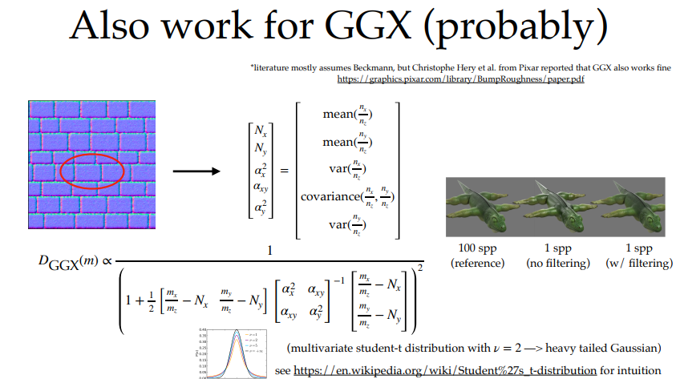
最后还需加上一个表面的 roughness ，即$\hat{\alpha_x^2}， \hat{\alpha_y^2}$。normal map 是宏观的，而 roughness 是更加微观的内容，数学上，其相互独立，如此能够直接相加，协方差和均值为0。
!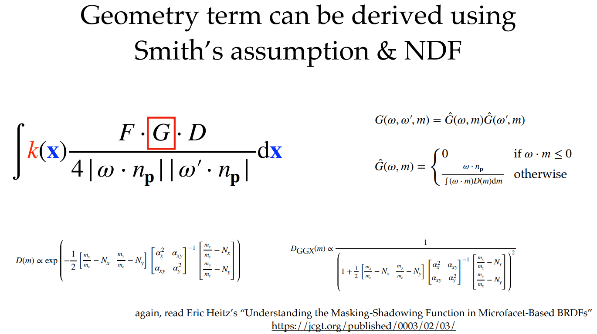
对于 $G$ 项采用上图使用的公式
!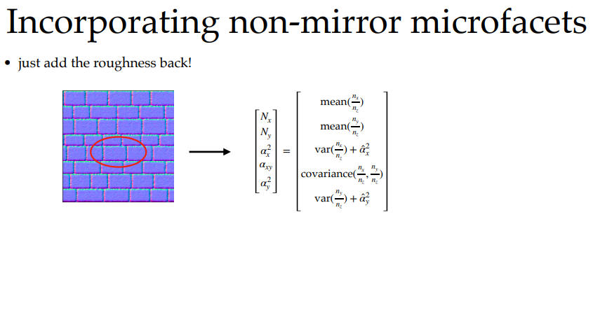
对于
$$
p(\zeta) = \frac{1}{2\pi \sqrt{\alpha_x^2\alpha_y^2 - \alpha_{xy}^2}} \exp{\left( 
- \frac{1}{2}

\begin{bmatrix}
\frac{m_x}{m_z} - N_x & \frac{m_y}{m_z} - N_y
\end{bmatrix}

\begin{bmatrix}
\alpha_x^2 & \alpha_{xy} \\
\alpha_{xy} & \alpha_y^2
\end{bmatrix}^{-1}

\begin{bmatrix}
\frac{m_x}{m_z} - N_x \\ 
\frac{m_y}{m_z} - N_y
\end{bmatrix}

\right)}
$$
### 从 NDF 到 roughness (从哪里来)
对于 Center Beckmann NDF 即
$$
\begin{pmatrix}
\zeta_x \\
\zeta_y
\end{pmatrix}
\sim
\mathcal{N}
\begin{pmatrix}
\begin{pmatrix}
0 \\
0
\end{pmatrix}
,
\begin{pmatrix}
\alpha_x^2 & 0 \\
0 & \alpha_y^2
\end{pmatrix}
\end{pmatrix}
$$
对于 Isotropic BRDF 这时候有 $\alpha_x = \alpha_y = \alpha$
对于 Off-centered Beckmann NDF 即
$$
\begin{pmatrix}
\zeta_x \\
\zeta_y
\end{pmatrix}
\sim
\mathcal{N}
\begin{pmatrix}
\begin{pmatrix}
N_x \\
N_y
\end{pmatrix}
,
\begin{pmatrix}
\alpha_x^2 & \alpha_{xy} \\
\alpha_{xy} & \alpha_y^2
\end{pmatrix}
\end{pmatrix}
$$
其 roughness 的计算为协方差矩阵 $\Sigma$ 的特征值开方（这部分的数学应该是在矩阵论里面有，但是目前我还没接触）
$$
\Sigma = 
\begin{pmatrix}
\alpha_x^2 & \alpha_{xy} \\
\alpha_{xy} & \alpha_y^2
\end{pmatrix}
$$
 现在再次引入 Normal Map 有协方差，其中 $\alpha_x^2,\ \alpha_y^2$ 为 Normal Map 的法线分布，$\hat{\alpha}_x^2,\ \hat{\alpha}_y^2$ 为基础粗糙度的方差。
$$
\Sigma = 
\begin{pmatrix}
\alpha_x^2 + \hat{\alpha}_x^2 & \alpha_{xy} \\
\alpha_{xy} & \alpha_y^2 + \hat{\alpha}_y^2
\end{pmatrix}
$$
一、若 $\alpha_{xy} = 0$
 - 若各项同性，即
$$
roughness = \alpha = \sqrt{\frac{(\alpha_x^2 + \hat{\alpha}_x^2)+(\alpha_y^2 +\hat{\alpha}_y^2)}{2}}
$$
- 若各项异性
$$
\alpha_x = \sqrt{\alpha_x^2 + \hat{\alpha}_x^2},\qquad \alpha_y = \sqrt{\alpha_y^2+\hat{\alpha}_y^2} 
$$
二、若$\alpha_{xy} \neq 0$
- 若各项同性
$$
roughness = \alpha = \sqrt{\frac{\lambda_1 + \lambda_2}{2}}
$$
- 若各项异性  
$$
\alpha_x = \sqrt{\lambda_1}, \qquad \alpha_y = \sqrt{\lambda_2}
$$
## 从 roughness 到 NDF
### Centered Beckmann NDF
各项同性时，即$\alpha_x = \alpha_y = \alpha$
$$
D_{Beck}(m) = \frac{1}{\pi \alpha_x \alpha_y m_z^4} \exp \left[ -\frac{1}{m_z^2} \left( \frac{m_x^2}{\alpha_x^2}+\frac{m_y^2}{\alpha_y^2} \right) \right]
$$
代入有
$$
D(m) = \frac{1}{\pi \alpha^2 m_z^4} \exp \left( - \frac{1 - m_z^2}{\alpha^2 m_z^2} \right), \qquad m_Z > 0
$$
各项异性时
$$
D_{Beck}(m) = \frac{1}{\pi \alpha_x \alpha_y m_z^4} \exp \left[ -\frac{1}{m_z^2} \left( \frac{m_x^2}{\alpha_x^2}+\frac{m_y^2}{\alpha_y^2} \right) \right]
$$
C++ 实现有 
``` c++
#include <glm/glm.hpp>
#include <cmath>

// Centered 各项同性 Beckman NDF
float beckmannD_isotropic(const glm::vec3& m, flaot alpha)
{
	if (m.z <= 0.0f) return 0.0f;
	float alpha2 = alpha * alpha;
	float mz2 = m.z * m.z;
	float mz4 = mz2 * mz2;
	float tan2 = (1.0f - mz2) / mz2;
	float exponent = -tan2 / alpha2;
	return std::exp(exponent) / (glm::pi<float>() * alpha2 * mz4);
}

// Centered 各项异性 Beckmann NDF 
float beckmannD_anisotropic(const glm::vec3& m, float ax, float ay)
{
	if (m.z <= 0.0f) return 0.0f;
	float mz2 = m.z * m.z;
	float mz4 = mz2 * mz2;
	float term = (m.x * m.x) / (ax * ax) + (m.y * m.y) / (ay * ay);
	float exponent = -term / mz2;
	return std:::exp(exponent) / (glm::pi<float>() * ax * ay * mz4);
}
```
## Off-Centered Beckmann NDF
协方差矩阵 $\Sigma$ 为正定，故能对角化有
$$
\Sigma = V\Lambda V^T
$$
其中 $\Lambda = diag(\lambda_1, \lambda_2)$
令
$$
\zeta' = \zeta - N
$$
有
$$
\zeta' \sim \mathcal{N}(0, \Sigma)
$$
令
$$
\zeta'' = V^T \zeta'
$$
有
$$
\zeta'' \sim \mathcal{N}(0, \Lambda) = \mathcal{N}\left( 
\begin{pmatrix}
0 \\
0
\end{pmatrix}
,\ 
\begin{pmatrix}
\lambda_1 & 0 \\
0 & \lambda_2
\end{pmatrix}
\right)
$$
故对于 $\zeta'' \text对应的 m'' = (m_x'',\ m_y'',\ m_z'') \text 为标准化坐标系中的表示。roughness 为：\sqrt{\lambda_1}, \ \sqrt{\lambda_2}$
问题就变成如何计算 $\zeta'$
$$
\zeta'_x = \frac{m_x}{m_z} - N_x,\qquad \zeta'_y = \frac{m_y}{m_z} - N_y
$$
整理等式有
$$
m_z\zeta'_x = m_x - N_xm_z, \qquad m_z\zeta'_y = m_y - N_ym_z
$$
故有
$$
\begin{pmatrix}
m_x - N_xm_z \\
m_y - N_ym_z \\
m_z
\end{pmatrix}
=
\begin{pmatrix}
m_z \zeta'_x \\
m_z \zeta'_y \\
m_z
\end{pmatrix}
$$
对于原平面有切线坐标$\mathbf{t}_g,\ \mathbf{b}_g,\ \mathbf{n}_g$，有
$$
\mathbf{m} = m_x \mathbf{t}_g + m_y \mathbf{b}_g + m_z\mathbf{n}_g
$$
$$
\begin{pmatrix}
\mathbf{t}_g & \mathbf{b}_g & \mathbf{n}_g
\end{pmatrix}
\begin{pmatrix}
m_z\zeta'_x \\
m_z\zeta'_y \\
m_z
\end{pmatrix}
=
\begin{pmatrix}
\mathbf{t}_g & \mathbf{b}_g & \mathbf{n}_g
\end{pmatrix}
\begin{pmatrix}
m_x - N_xm_z \\  m_y - N_ym_z \\ 
m_z
\end{pmatrix}
$$
$$
=
\begin{pmatrix}
\mathbf{t}_g & \mathbf{b}_g & \mathbf{n}_g
\end{pmatrix}
\begin{pmatrix}
1 & 0 & -N_x \\
0 & 1 & -N_y \\
0 & 0 & 1
\end{pmatrix}
\begin{pmatrix}
m_x \\
m_y \\
m_z
\end{pmatrix}
$$
$$
=
\begin{pmatrix}
\mathbf{t}_g & \mathbf{b}_g & -N_x\mathbf{t}_g-N_y\mathbf{b}_g + \mathbf{n}_g
\end{pmatrix}
\begin{pmatrix}
m_x \\
m_y \\
m_z
\end{pmatrix}
$$
$$
\begin{pmatrix}
\mathbf{t}_g & \mathbf{b}_g & \mathbf{n}_g
\end{pmatrix}
\begin{pmatrix}
\zeta'_x \\
\zeta'_y \\
1
\end{pmatrix}
=
\begin{pmatrix}
\mathbf{t}_g & \mathbf{b}_g & -N_x\mathbf{t}_g-N_y\mathbf{b}_g + \mathbf{n}_g
\end{pmatrix}
\begin{pmatrix}
\frac{m_x}{m_z} \\
\frac{m_y}{m_z} \\
1
\end{pmatrix}
$$
即
$$
\begin{pmatrix}
\mathbf{t}_g & \mathbf{b}_g & \mathbf{n}_g
\end{pmatrix}
\begin{pmatrix}
\zeta'_x \\
\zeta'_y \\
1
\end{pmatrix}
=
\begin{pmatrix}
\mathbf{t}_g & \mathbf{b}_g & -N_x\mathbf{t}_g-N_y\mathbf{b}_g + \mathbf{n}_g
\end{pmatrix}
\begin{pmatrix}
\zeta_x \\
\zeta_y \\
1
\end{pmatrix}
$$
即可求得
$$
\begin{pmatrix}
\zeta'_x \\
\zeta'_y \\
1
\end{pmatrix}
=
\begin{pmatrix}
\mathbf{t}_g & \mathbf{b}_g & \mathbf{n}_g
\end{pmatrix}^{T}
\begin{pmatrix}
\mathbf{t}_g & \mathbf{b}_g & -N_x\mathbf{t}_g-N_y\mathbf{b}_g + \mathbf{n}_g
\end{pmatrix}
\begin{pmatrix}
\zeta_x \\
\zeta_y \\
1
\end{pmatrix}
$$
有 
$$
\zeta'' =  V^T\zeta'
$$
$$
V^T
\begin{pmatrix}
\zeta'_x \\
\zeta'_y \\
1
\end{pmatrix}
= 
V^T
\begin{pmatrix}
\mathbf{t}_g & \mathbf{b}_g & \mathbf{n}_g
\end{pmatrix}^{T}
\begin{pmatrix}
\mathbf{t}_g & \mathbf{b}_g & -N_x\mathbf{t}_g-N_y\mathbf{b}_g + \mathbf{n}_g
\end{pmatrix}
\begin{pmatrix}
\zeta_x \\
\zeta_y \\
1
\end{pmatrix}
$$
问题就变成如何计算 $\zeta''$
原坐标基为：
$$
\begin{pmatrix}
\mathbf{t}_g & \mathbf{b}_g & \mathbf{n}_g
\end{pmatrix}
$$
新坐标基为：
$$
\begin{pmatrix}
\mathbf{t}_g' & \mathbf{b}_g' & \mathbf{n}_g'
\end{pmatrix}
$$
那么有 
$$
\begin{pmatrix}
\mathbf{t}_g & \mathbf{b}_g & \mathbf{n}_g
\end{pmatrix}
\begin{pmatrix}
\zeta_x \\
\zeta_y \\
1
\end{pmatrix}
=
k
\begin{pmatrix}
\mathbf{t}_g' & \mathbf{b}_g' & \mathbf{n}_g'
\end{pmatrix}
\begin{pmatrix}
\zeta_x'' \\
\zeta_y'' \\
1
\end{pmatrix}
$$
由于
$$
\zeta'' = V^T(\zeta - N)
$$
故
$$
\zeta = V\zeta'' + N
$$
有
$$
\zeta_x = V_{11}\zeta''_x + V_{12}\zeta_y'' + N_x, \qquad
\zeta_y = V_{21}\zeta''_x + V_{22}\zeta_y'' + N_y
$$
代入式子
$$
\begin{pmatrix}
\mathbf{t}_g & \mathbf{b}_g & \mathbf{n}_g
\end{pmatrix}
\begin{pmatrix}
V_{11}\zeta''_x + V_{12}\zeta_y'' + N_x \\
V_{21}\zeta''_x + V_{22}\zeta_y'' + N_y \\
1
\end{pmatrix}
=
k
\begin{pmatrix}
\mathbf{t}_g' & \mathbf{b}_g' & \mathbf{n}_g'
\end{pmatrix}
\begin{pmatrix}
\zeta_x'' \\
\zeta_y'' \\
1
\end{pmatrix}
$$
故
$$
\begin{pmatrix}
\mathbf{t}_g & \mathbf{b}_g & \mathbf{n}_g
\end{pmatrix}
\begin{pmatrix}
V_{11} & V_{12} & N_x \\
V_{21} & V_{22} & N_y \\
0 & 0 & 1
\end{pmatrix}
\begin{pmatrix}
\zeta''_x \\
\zeta''_x \\
1
\end{pmatrix}
=
k
\begin{pmatrix}
\mathbf{t}_g' & \mathbf{b}_g' & \mathbf{n}_g'
\end{pmatrix}
\begin{pmatrix}
\zeta_x'' \\
\zeta_y'' \\
1
\end{pmatrix}
$$
故
$$
\begin{pmatrix}
\mathbf{t}_g & \mathbf{b}_g & \mathbf{n}_g
\end{pmatrix}
\begin{pmatrix}
V_{11} & V_{12} & N_x \\
V_{21} & V_{22} & N_y \\
0 & 0 & 1
\end{pmatrix}
=
k
\begin{pmatrix}
\mathbf{t}_g' & \mathbf{b}_g' & \mathbf{n}_g'
\end{pmatrix}
$$
$$
\begin{pmatrix}
\mathbf{t}_g V_{11} + \mathbf{b}_gV_{21} & 
\mathbf{t}_g V_{12} + \mathbf{b}_gV_{22} & 
\mathbf{t}_g N_x + \mathbf{b}_g N_y + \mathbf{n}_g
\end{pmatrix}
=
k
\begin{pmatrix}
\mathbf{t}_g' & \mathbf{b}_g' & \mathbf{n}_g'
\end{pmatrix}
$$
故设
$$
C =
\begin{pmatrix}
\mathbf{c}_1 & \mathbf{c}_2 & \mathbf{c}_3
\end{pmatrix}
=
k
\begin{pmatrix}
\mathbf{t}_g' & \mathbf{b}_g' & \mathbf{n}_g'
\end{pmatrix}
$$
这时，得到的基是方向上是一致的了，但是k不能同时满足三个向量长度全为1.
但是,通常 $k \approx 1$ 故此认为 $C$ 为新的基底 $\mathbf{n}_g'$ 为新法线,但是新基底 $C$ 为非正交基,故此我们需要基于 $\mathbf{c}_3$ 算出新基
故此,
$$
\mathbf{n}_{target} = \mathbf{c}_3 = \frac{\mathbf{n}_g'}{|| \mathbf{n}_g' ||} 
$$
$$
\mathbf{t}_{temp} = \mathbf{c}_1
$$
$$
\mathbf{t}_{target} = normalize(\mathbf{t}_{temp} - (\mathbf{t}_{temp} · \mathbf{n}_{target})\mathbf{n}_{target})
$$
$$
\mathbf{b}_{target} = \mathbf{n}_{target} \times \mathbf{t}_{traget}
$$
将旧向量投影到新坐标有
$$
m_x'' = \mathbf{m} \ ·\ \mathbf{t}_{target}, \qquad m_y'' = \mathbf{m} \ ·\ \mathbf{b}_{target}, \qquad m_z'' = \mathbf{m} \ ·\ \mathbf{n}_{target}, 
$$
最后计算
$$
\alpha_1 = \sqrt{\lambda_1}, \qquad \alpha_2 = \sqrt{\lambda_2}
$$
$$
D(m'') = \frac{1}{\pi \alpha_1 \alpha_2 (m_z'')^4} \exp \left[ -\frac{1}{(m_z'')^2} \left( \frac{(m_x'')^2}{\alpha_1^2} + \frac{(m_y'')^2}{\alpha_2^2} \right) \right]
$$
```c++
#include <glm/glm.hpp>
#include <glm/gtc/constants.hpp>
#include <glm/gtc/matrix_transform.hpp>
#include <vector>
#include <cmath>

// ---------- 2x2 实对称矩阵特征分解 ----------
struct Eigen2 {
    glm::vec2 values;   // lambda1 >= lambda2
    glm::mat2 vectors;  // 列0对应lambda1的特征向量，列1对应lambda2
};

Eigen2 eigenDecompose2x2(const glm::mat2& M) {
    float a = M[0][0], b = M[0][1], c = M[1][1];
    float trace = a + c;
    float det = a * c - b * b;
    float disc = std::sqrt(trace * trace - 4.0f * det);
    float lambda1 = (trace + disc) * 0.5f;
    float lambda2 = (trace - disc) * 0.5f;

    glm::vec2 v1(1.0f, 0.0f), v2(0.0f, 1.0f);
    if (std::abs(b) > 1e-6f) {
        v1 = glm::normalize(glm::vec2(lambda1 - c, b));
        v2 = glm::normalize(glm::vec2(lambda2 - c, b));
    }
    if (lambda1 < lambda2) {
        std::swap(lambda1, lambda2);
        std::swap(v1, v2);
    }
    return { glm::vec2(lambda1, lambda2), glm::mat2(v1, v2) };
}

// ---------- 从法线贴图纹素统计斜率均值和协方差 ----------
struct NormalStats {
    glm::vec2 mean;   // (Nx, Ny)
    glm::mat2 sigma;  // 纹理部分协方差
};

NormalStats computeNormalMapStats(const std::vector<glm::vec3>& normals) {
    size_t N = normals.size();
    if (N == 0) return { glm::vec2(0), glm::mat2(0) };

    glm::vec2 sum(0);
    for (const auto& n : normals) {
        if (n.z <= 0) continue;
        sum += glm::vec2(n.x / n.z, n.y / n.z);
    }
    glm::vec2 mean = sum / (float)N;

    float varX = 0, varY = 0, cov = 0;
    for (const auto& n : normals) {
        if (n.z <= 0) continue;
        glm::vec2 zeta(n.x / n.z, n.y / n.z);
        glm::vec2 d = zeta - mean;
        varX += d.x * d.x;
        varY += d.y * d.y;
        cov  += d.x * d.y;
    }
    varX /= N; varY /= N; cov /= N;
    glm::mat2 sigma(varX, cov,    // 第一列
                    cov,  varY);  // 第二列
    return { mean, sigma };
}

// ---------- 合并基础粗糙度（方差相加） ----------
glm::mat2 combineWithBaseRoughness(const glm::mat2& sigmaTex,
                                   float baseAx, float baseAy) {
    float a2 = baseAx * baseAx;
    float b2 = baseAy * baseAy;
    return glm::mat2(sigmaTex[0][0] + a2, sigmaTex[0][1],
                     sigmaTex[1][0],        sigmaTex[1][1] + b2);
}

// ---------- 构建等效局部坐标系 ----------
struct LocalFrame {
    glm::vec3 n, t, b;   // 世界空间下的正交基
    float ax, ay;        // 等效粗糙度
};

LocalFrame buildLocalFrame(const glm::vec3& ng, const glm::vec3& tg, const glm::vec3& bg,
                           const glm::vec2& mean, const glm::mat2& sigmaTotal) {
    LocalFrame frame;

    // 等效法线
    frame.n = glm::normalize(ng + mean.x * tg + mean.y * bg);

    // 特征分解
    Eigen2 eig = eigenDecompose2x2(sigmaTotal);
    frame.ax = std::sqrt(eig.values.x);
    frame.ay = std::sqrt(eig.values.y);

    // 切线：第一特征向量世界空间方向，正交化
    glm::vec3 t_rough = eig.vectors[0].x * tg + eig.vectors[0].y * bg;
    frame.t = glm::normalize(t_rough - glm::dot(t_rough, frame.n) * frame.n);

    // 副法线
    frame.b = glm::cross(frame.n, frame.t);
    return frame;
}

// ---------- off‑centered Beckmann NDF（法线贴图滤波后） ----------
float filteredBeckmannD(const glm::vec3& m,                   // 微表面法线（世界空间）
                        const glm::vec3& ng, const glm::vec3& tg, const glm::vec3& bg,
                        const glm::vec2& mean, const glm::mat2& sigmaTotal) {
    LocalFrame L = buildLocalFrame(ng, tg, bg, mean, sigmaTotal);

    float mx = glm::dot(m, L.t);
    float my = glm::dot(m, L.b);
    float mz = glm::dot(m, L.n);
    if (mz <= 0.0f) return 0.0f;

    // 标准各向异性 Beckmann（公式与centered无异）
    float mz2 = mz * mz;
    float mz4 = mz2 * mz2;
    float term = (mx * mx) / (L.ax * L.ax) + (my * my) / (L.ay * L.ay);
    float exponent = -term / mz2;
    return std::exp(exponent) / (glm::pi<float>() * L.ax * L.ay * mz4);
}

// ---------- 示例 ----------
/*
int main() {
    std::vector<glm::vec3> texels = { ... };
    NormalStats stats = computeNormalMapStats(texels);
    glm::mat2 sigmaTotal = combineWithBaseRoughness(stats.sigma, 0.3f, 0.4f);
    glm::vec3 ng(0,0,1), tg(1,0,0), bg(0,1,0);
    glm::vec3 h = glm::normalize(glm::vec3(0.3, -0.1, 0.95));
    float ndf = filteredBeckmannD(h, ng, tg, bg, stats.mean, sigmaTotal);
    printf("NDF = %f\n", ndf);
}
*/
```
## 回到原来的积分
$$
\int k(x) f_p(\omega(x), \omega') \ dx
$$
带入 microfacet BRDF
$$
\int k(x) \frac{F·G·D}{4 |\omega · n_p||\omega' · n_p|} dx 
$$
即可求得对应的积分
这个方法还是会漏掉一些细节
!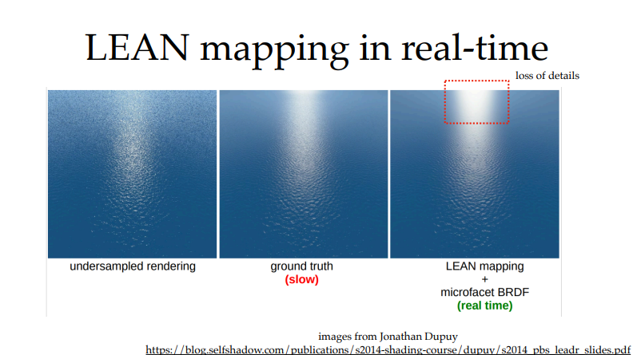
## LEAN/LEADR 映射不仅可以处理法线贴图，还可以直接应用于**位移贴图**
!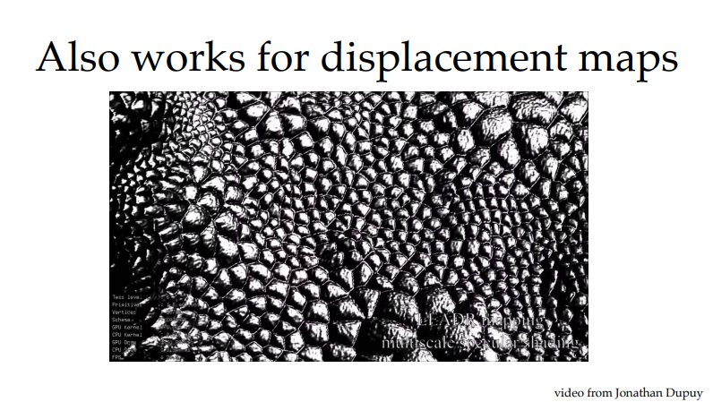
## 是否有更好的方法处理NDF？
遇到的问题：当法线贴图分辨率远高于像素采样率时，像素内会包含许多细小的镜面微面元。随着视角或光照轻微变化，某些微面元会突然满足镜面反射条件，产生极其明亮的点，即“glints”（闪烁）。直接用 LEAN 的高斯近似会把这些闪烁完全平滑掉。
!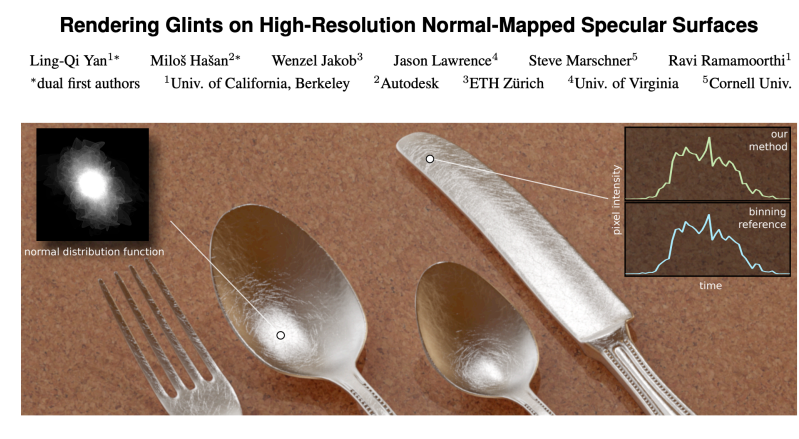
### Idea
对于给定的入射/出射方向 $\omega, \omega'$，只有法线朝向近似等于半向量方向的纹素才对高光有贡献。因此可以遍历区域内所有纹素，数出满足条件的纹素数量（或面积占比）。
!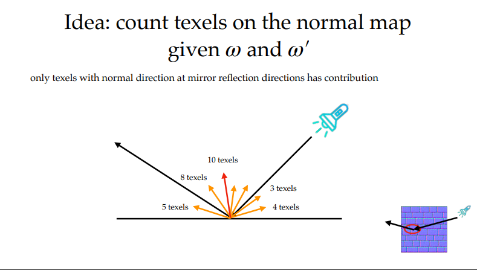
**缺点**：这种方法极度不稳定——方向微小变化可能导致计数突变，产生严重的噪声。
**改进**：用一个高斯权重软化计数，即对每个纹素，根据其法线与理想镜面反射方向的接近程度赋予权重，而不是 0/1 硬判定。这很像是将 NDF 视为一个高斯核的卷积。
**做法**：把“法线方向的高斯一致性”与“空间像素滤波核”合并成一个统一的权重，从而直接计算像素内的高光贡献。
每个纹素的总权重 = 空间滤波核 × 法线方向的高斯权重。
该方法等价于在一个更高维的空间（位置+法线）上做滤波。
!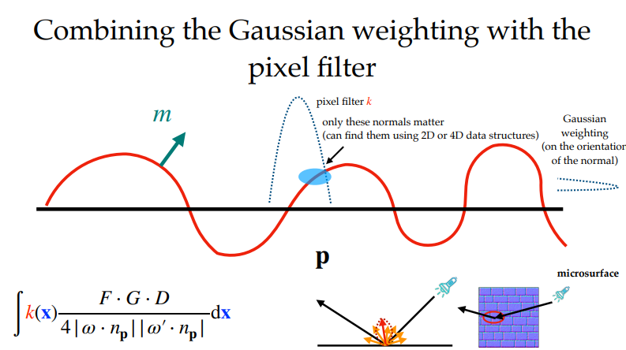
**效果**
!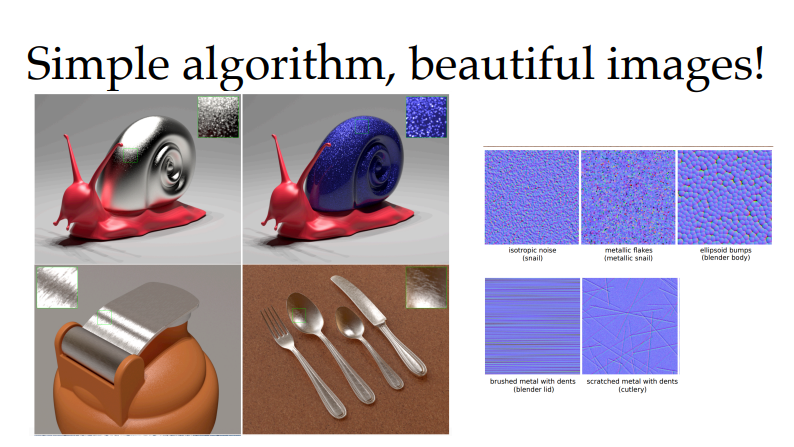
## 更加激进的想法：程序化生成微观几何
!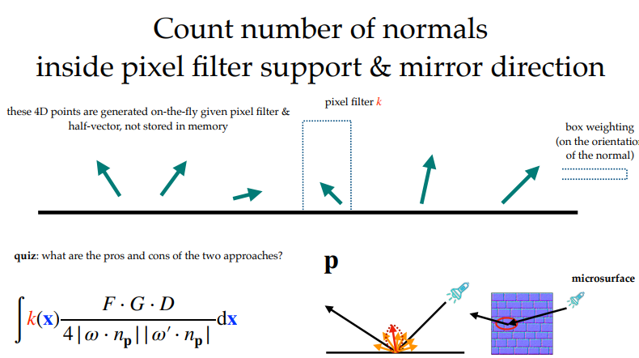
**核心思想**：用一组程序化生成的、位置和法线都随机的点（microflake 或 microfacet）来替代连续的法线贴图。每个点携带一个法线和一个位置，并且随机分布。
渲染时，统计像素滤波核覆盖范围内，且法线方向恰好能形成镜面反射的点数量。这等效于在“像素空间 × 法线空间”里做泊松采样或随机计数。
**优点**：不需要存储庞大的法线贴图，天生就是连续且无限分辨率的，glints 效果非常自然，滤波也变成简单的统计问题。
**缺点**：生成分布需要精心设计（保持物理合理性），而且采样效率要求高，否则噪声很大；对于非镜面BSDF需要更多处理。
这本质上是用**点过程**替代**纹理**，与 LEAN mapping 形成鲜明对比：LEAN 是把法线分布压缩为矩，而离散随机微面元则是直接生成样本。
## 用神经网络合成复杂 NDF
!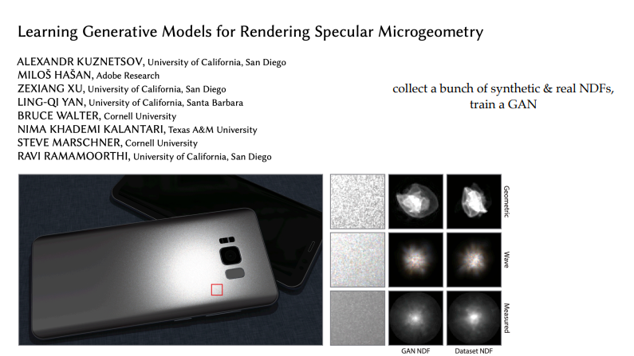
## 动态/空间变化的复杂 NDF 是活跃研究方向
!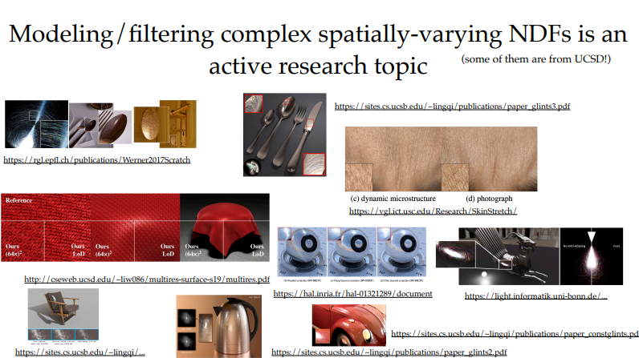
目前对复杂、空间变化的 NDF 建模与滤波仍在快速发展中。

几个前沿方向：
- 动态微结构（比如皮肤拉伸导致的微几何变化）
- 基于照片的材质重建
- 高度真实的材质模型（如海面、车漆等）
## Sometimes, good importance sampling can go a long way
对于超高频率的 caustics 和 glints，即使模型近似很困难，但通过**更好的重要性采样**也可以有效渲染。
!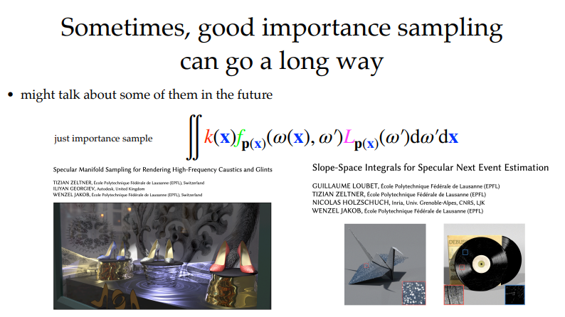